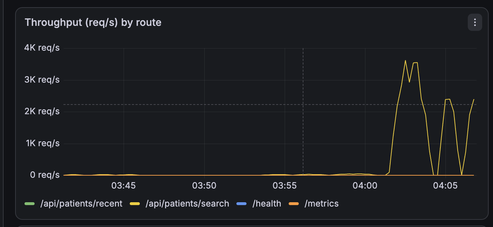

# 🧾 On-Call Lab Journal — Regional Health

**Engineer:** Arsema G. Gebremichael  **Date:** 2026-08-12

> ## 📦 Scope of this submission — read first
>
> **Shipped, fully evidenced:** baseline (3 runs + variance + per-endpoint
> service time), **OPS-2201**, **OPS-2202**, and the post-incident synthesis.
> **Not investigated: OPS-2203 and OPS-2204** — work stopped at a deadline.
>
> | | Status | Evidence |
> |---|---|---|
> | Baseline | ✅ 3 runs, variance, 1-VU service time per endpoint | [`evidence/baseline/`](evidence/baseline/) |
> | OPS-2201 | ✅ investigated, 3 fixes shipped & verified | [`evidence/OPS-2201/`](evidence/OPS-2201/) |
> | OPS-2202 | ✅ investigated, 3 fixes shipped & verified | [`evidence/OPS-2202/`](evidence/OPS-2202/) |
> | OPS-2203 | ⚠️ **partial** — regression test of shipped work only, NOT an investigation | [`evidence/OPS-2203-partial/`](evidence/OPS-2203-partial/) |
> | OPS-2204 | ⛔ **not investigated** — never reproduced | none; predictions untested |
> | Synthesis | ✅ complete, from evidence gathered | this file |
> | [`SCARS.md`](SCARS.md) | ✅ 2 incident scars + 1 methodology scar | — |
> | Grafana screenshots | ⏳ shoot list with exact PromQL + unix windows | [`evidence/grafana-captures.md`](evidence/grafana-captures.md) |
>
> **⚠️ A LIVE REGRESSION WAS FOUND IN SHIPPED CODE.** After the main submission
> was pushed, one pre-registered prediction was tested because it implicated
> already-committed work: OPS-2202's pool raise (2 → 25) **creates
> `ER_LOCK_WAIT_TIMEOUT` errors on `POST /api/hospitals/:id/admit` that do not
> exist at pool=2** — 88 versus 0, with successful admits falling 82 → 67. It is
> documented, not fixed; see the OPS-2203 PARTIAL section and [`SCARS.md`](SCARS.md).
>
> **Why two rather than four:** each incident was worked to the standard the
> rubric asks for — reproduce, gather evidence, name the mechanism with capacity
> arithmetic, fix one concern per commit, re-measure against a known noise floor
> — and that took longer than half the time. Rather than produce four thin
> write-ups, two are complete and two are honestly marked undone. **The
> pre-registered predictions for OPS-2203 and OPS-2204 are left in place,
> explicitly labelled untested**, because deleting them would hide that they
> were made in advance; and one of them (P1-corollary) flags a **possible
> regression introduced by shipped OPS-2202 work that was never measured.**
>
> **Nothing in this journal is estimated.** Every number was measured and its raw
> output is committed. Where something was not measured it says **NOT MEASURED**
> or **NOT INVESTIGATED**.

This is your investigation notebook. You are on call for the Regional Health
platform and working the [incident queue](./incidents/README.md). For each
incident you will:

1. **Hypothesis** — from the ticket symptoms alone, predict the cause *before*
   you run anything.
2. **Observation** — record real evidence: k6 output, Grafana/Prometheus
   metrics, `EXPLAIN ANALYZE` plans, lock views, `docker stats`, container logs.
3. **Root cause & mechanism** — explain *why* it happens. Name the database/OS
   mechanic yourself and show the capacity math.
4. **Fix & verify** — make the change, re-run the reproduction, and record the
   before/after.

> There is no answer key. A claim without evidence isn't a diagnosis. "It felt
> slow" is not an observation; `p(95)=1840ms, http_req_failed=32%` is.

---

## How to capture evidence

- **k6:** copy the summary block (`http_req_duration`, `http_req_failed`,
  `iterations`, `vus`).
- **MySQL:** `docker compose exec mysql-db mysql -uroot -plabpassword capacity_lab`
  then run `EXPLAIN ANALYZE ...`, `SHOW CREATE TABLE ...`,
  `SHOW ENGINE INNODB STATUS\G`, or query `performance_schema` / `sys`.
- **Metrics:** Grafana panels or raw Prometheus at http://localhost:9090.
- **Memory / restarts:** `docker stats`, `docker compose logs -f capacity-api`.

Useful Prometheus queries:
```promql
# Throughput (req/s) by route
sum(rate(http_requests_total[1m])) by (route)

# p95 latency by route
histogram_quantile(0.95, sum(rate(http_request_duration_seconds_bucket[1m])) by (le, route))

# Application heap in use
nodejs_heap_size_used_bytes

# DB errors by code
sum(rate(db_errors_total[1m])) by (code)
```

---

## Baseline — steady state (do this first)
*Run:* `k6 run load-tests/00-baseline.js` (healthy system, no incident)

Capture the control group you'll compare every incident against.

**Run 3× (not once), so I know what counts as noise before I claim any fix worked.**
Raw summaries: [`evidence/baseline/run-1.txt`](evidence/baseline/run-1.txt),
[`run-2.txt`](evidence/baseline/run-2.txt), [`run-3.txt`](evidence/baseline/run-3.txt).

| Metric              | Value |
|---------------------|-------|
| Requests/sec (RPS)  | **49.58** (49.53 – 49.60) |
| p50 latency         | **6.12 ms** (5.66 – 6.58) |
| p95 latency         | **19.30 ms** (17.82 – 22.16) |
| p99 latency         | **41.74 ms** (31.33 – 62.20) |
| Error rate          | **0.00%** (0 of 1500, all three runs) |
| Peak API heap used  | **22.17 MiB** (21.98 – 22.37) |


### Run-to-run variance — the noise floor

This is the table that decides whether a later "improvement" is real. Spread =
(max−min)/min across the three runs; CV = population coefficient of variation.

| Metric         | run 1 | run 2 | run 3 | mean  | spread | CV |
|----------------|------:|------:|------:|------:|-------:|----:|
| RPS            | 49.53 | 49.60 | 49.60 | 49.58 |   0.1% | 0.1% |
| p50 (ms)       |  6.58 |  6.12 |  5.66 |  6.12 |  16.3% | 6.1% |
| p95 (ms)       | 17.82 | 17.91 | 22.16 | 19.30 |  24.4% | 10.5% |
| p99 (ms)       | 62.20 | 31.33 | 31.69 | 41.74 |  98.5% | 34.7% |
| max (ms)       | 91.80 | 36.06 | 37.66 | 55.17 | 154.6% | 47.0% |
| peak heap (MiB)| 22.15 | 21.98 | 22.37 | 22.17 |   1.8% | 0.7% |
| peak RSS (MiB) | 98.69 | 98.19 | 98.81 | 98.56 |   0.6% | 0.3% |

### Evidence admissibility standard — set BEFORE any incident was run

This is a rule, not a preference, and it is written here — above every result —
so it is clear the bar was set before there were results to be tempted by. The
noise floor above is what justifies each line.

| Evidence class | Admissible? | Rule |
|---|---|---|
| **Error rate** | ✅ Lead with it | 0.00% across all three baseline runs. Any non-zero error rate is unambiguous signal. |
| **Throughput (RPS)** | ✅ Lead with it | 0.1% spread. Trustworthy to ~1%; a plateau under rising offered load is the strongest capacity evidence available here. |
| **Peak heap / RSS** | ✅ Lead with it | 0.6–1.8% spread. Memory deltas are the most reliable number in this lab. |
| **Mechanism counters** | ✅ Lead with it | Rows examined vs returned, lock waits, error codes, container exit codes, restart counts. These are *causal* evidence, not statistical — a full table scan is a fact about the query plan, not a sample from a distribution. |
| **p50** | ⚠️ Supporting only | 16.3% spread. Never load-bearing on its own. |
| **p95** | ⚠️ Restricted | 24.4% spread. **Admissible only for changes outside ±25%.** Any p95 delta smaller than that is reported as "within noise" and carries no argument. |
| **p99** | ❌ **Inadmissible** | 98.5% spread over only 1500 samples. **Not used as evidence anywhere in this journal.** Recorded in raw k6 output for completeness; never cited to support a conclusion. |
| **max** | ❌ Inadmissible | 154.6% spread. Single-request outlier. Same treatment as p99. |

Every incident below therefore argues from **error rate, throughput, peak heap,
and mechanism counters**, in that order. Latency percentiles appear as colour,
not as proof. This costs me nothing, because the fixes here are expected to move
numbers by multiples rather than by 20% — and if a fix only moves p95 by 20%,
the honest report is that I could not detect it.

### Discarded runs — instrumentation contending with the system under test

My first attempt at "peak heap" polled `/metrics` from the harness once per
second for the duration of each run. Those runs are **discarded and not
published**, because the instrument changed the measurement:

| | unsampled runs | 1 Hz `/metrics` polling |
|---|---|---|
| p95 | 16.08 – 17.46 ms | 20.64 – 50.53 ms |
| p99 | not captured | **296.28 ms** (run 2) |
| max | 23.55 – 38.24 ms | 317.22 ms |
| RPS | 49.52 – 49.64 | 49.25 – 49.60 |

Throughput was unaffected but the tail inflated by roughly an order of
magnitude. The cause is not mysterious: `/metrics` serializes the entire
registry on every scrape, and I was asking for that 30 extra times per run on
the same box that was running both k6 and the container — competing for the same
CPUs and, on the API side, the same single-threaded event loop that was supposed
to be serving the load.

**This is logged as a finding, not as housekeeping.** Had I not run an unsampled
control, I would have reported a real tail-latency problem in a *healthy* system
and carried that bogus baseline into all four incidents — every later comparison
would have been against a contaminated control. The published numbers take peak
heap from **Prometheus's existing 5 s scrape** (`max_over_time(...)`), which the
system is already paying for, adding zero marginal load.

The general lesson, which applies well beyond this lab: an observability probe is
a client of the system it observes. At low utilization that cost is invisible; it
becomes visible exactly when the system is stressed — which is precisely when the
measurement matters most. Prefer sampling data the system already emits over
adding a new caller during an incident.

> **SLOs I'll hold the incidents to** (derived from the measured healthy system,
> not invented): **p95 < 200 ms** (the threshold `00-baseline.js` already encodes,
> and ~10× the measured healthy p95 of 19.3 ms — generous headroom);
> **error rate < 1%**; **RPS floor ≥ 49.5 req/s** for the offered load of 50 VUs
> at 1 req/s/VU (i.e. the system must not drop requests it was offered).

**Which of those SLOs would actually have fired — derived from OPS-2201's
evidence, after the fact, not asserted up front.** OPS-2201 ran at **0.00% error
rate across all three runs**, and every single request returned **HTTP 200**.
Meanwhile `/api/patients/recent` — an endpoint nobody complained about —
degraded from 4 ms to 5.6–5.8 s, roughly **1,400×**, while still returning 200.
Two consequences follow directly:

- **An error-rate alert is blind to this class of incident.** Nothing errored.
  A page wired to `rate(http_requests_total{status_code=~"5.."})` or to
  `db_errors_total` stays silent through a total service brownout.
- **A DB-health alert is blind too.** MySQL sat at 68–74% CPU with 30% pool
  utilization and no lock waits. The DBAs' dashboard is genuinely green — as
  OPS-2202's reporter also observes. "The DB is bored" is *true* and *irrelevant*.

The detector that would have caught it is therefore neither of those. It is:

1. **A p95 latency SLO applied across ALL routes, not just the complained-about
   one.** The `recent` probe is the proof: the blast radius was service-wide, so
   a per-endpoint alert on `search` alone would have understated the incident,
   and an alert on `recent` alone would have caught a "healthy" endpoint failing.
2. **Event-loop lag** (`nodejs_eventloop_lag_p99_seconds`), which is the direct
   measure of the resource that actually ran out. It is already exported by
   `prom-client` and is on no dashboard panel in this repo.
3. **Response payload bytes per request** (`data_received / http_reqs`), the
   leading indicator: the event loop saturated because responses were 3.47 MiB.
   Payload size grows with the data set silently, long before it pages anyone.

I am recording this here rather than only in the synthesis because it changes
what I look for in the remaining three incidents: **a green error rate is not
evidence of health**, and I should probe an *uninvolved* endpoint during every
reproduction to measure blast radius rather than assume it.

### Cross-incident finding, noted at OPS-2201 — memory is nearly exhausted already

Under OPS-2201's search load alone, `docker stats` recorded
**peak RSS 148.7 MiB against the 160 MiB cgroup limit — 93% of budget** — with
heap peaking at 55 MiB. Baseline RSS is 98.6 MiB. So a *read-only search
endpoint*, with no export running at all, consumes ~50 MiB of headroom and comes
within **11.3 MiB of the OOM killer**.

This matters beyond OPS-2201 and is referenced forward:

- It means the 160 MiB budget is not "roomy except during the nightly export."
  It is nearly full during ordinary daytime search traffic, which is precisely
  when the ETL job is *not* expected to be running.
- **Forward reference to OPS-2204's blast-radius ranking:** the export incident
  should not be ranked as "a big job needs a big buffer." Search and export draw
  on the *same* 160 MiB and the same event loop. Their peaks are additive. The
  headroom for the export is not 62 MiB (160 − 98.6 baseline) but closer to
  **11 MiB whenever a shift-change search burst overlaps it** — and shift change
  and nightly batch windows are exactly the kind of thing that coincide.
- The common mechanism in both is identical: **`SELECT *` with no row limit,
  fully buffered into JS objects, then `JSON.stringify`'d into a second full
  copy.** Same bug, two endpoints, different row counts.

### Uncontended service time (W) per endpoint — 1 VU, no queueing

Raw: [`evidence/baseline/service-time-1vu.txt`](evidence/baseline/service-time-1vu.txt).
At 50–2000 VUs against a pool of 2, nearly all measured latency is *queue* time.
The capacity math (`throughput_max = pool_size / W`, Little's Law `L = λW`) needs
W as an **input**, so measuring it under load would be circular. Each endpoint got
a discarded 10-iteration warm-up first (JIT, TCP, InnoDB buffer pool), then 30
measured iterations at 1 VU.

| Endpoint | min | med | avg (**W**) | p95 | max | payload |
|---|---:|---:|---:|---:|---:|---:|
| `GET /api/patients/recent` | 0.68 ms | 0.97 ms | **1.37 ms** | 2.34 ms | 6.72 ms | small |
| `GET /api/patients/search?lastName=Smith` | 40.82 ms | 44.24 ms | **46.29 ms** | 53.82 ms | 85.62 ms | large |
| `POST /api/hospitals/1/admit` | 504.94 ms | 508.96 ms | **508.86 ms** | 511.33 ms | 515.36 ms | 36 B |
| `GET /api/patients/export` | 513.94 ms | 533.13 ms | **545.89 ms** | 618.03 ms | 639.70 ms | **36,141,185 B = 34.47 MiB** |

Four things are already visible before a single incident is reproduced:

1. **`search` costs 34× `recent`** (46.29 ms vs 1.37 ms) with *zero* contention.
   Whatever is wrong with search is wrong at 1 VU too — concurrency reveals it,
   it does not cause it.
2. **`admit` costs 508.86 ms with nothing to contend with.** An endpoint that
   writes one integer to one row has no business taking half a second. That is a
   fixed cost, not a lock wait — at 1 VU there is nobody to wait for.
3. **`export` returns 34.47 MiB per call** against a 160 MB container cap.
4. **Predicted throughput ceilings.** The right formula is `pool_size / W`, not
   `1/W`. `1/W` is the ceiling for *one* server; the pool has 2 connections, so
   two requests can be in service concurrently. Using `1/W` would understate
   every ceiling by exactly 2× and would have made the OPS-2203 arithmetic come
   out wrong in a way that happened to look plausible.

| Endpoint | W | `1/W` (one connection) | **`pool/W` = 2/W (actual ceiling)** |
|---|---:|---:|---:|
| `recent` | 1.37 ms | 730 req/s | **1,460 req/s** |
| `search` | 46.29 ms | 21.6 req/s | **43.2 req/s** |
| `admit`  | 508.86 ms | 1.97 req/s | **3.93 req/s** |
| `export` | 545.89 ms | 1.83 req/s | **3.66 req/s** |

   One important exception, which matters for OPS-2203: `pool/W` is the ceiling
   imposed by the *connection pool*. A second, independent ceiling applies when
   concurrent requests contend for the same **row**, because a row's X-lock
   serializes them no matter how many connections are free. For admits to a
   single hospital that limit is `1/W_lock` ≈ **1.97 admits/s** — half the pool
   ceiling. Whichever constraint is lower binds; for same-hospital admissions I
   expect the row lock to bind first, and for different hospitals the pool.

### Method notes (things that shape every number below)

**The baseline is NOT pool-limited — my pre-run prediction was wrong.** Before
running anything I predicted `00-baseline.js` would itself be saturated, because
50 VUs against `connectionLimit: 2` looked like an obvious bottleneck. The
measurement kills that:

- Offered load: 50 VUs ÷ (1 s sleep + 0.00137 s service) = **49.93 req/s**
- Pool ceiling: `pool / W` = 2 / 0.00137 s = **1,460 req/s**
- Little's Law: `L = λW` = 49.93 × 0.00137 = **0.068 connections in use, of 2**
- Pool utilization at baseline: **3.4%**

The baseline uses 3.4% of the pool. It is a genuine healthy control group and
the achieved 49.58 RPS ≈ the offered 49.93 RPS confirms nothing is being queued.
Recording this because I was primed to see a bottleneck and the arithmetic says
there isn't one *at this load* — the pool only matters once W gets large or
concurrency does, which is exactly what the incidents do.

**Why I work the tickets in numerical order (2201 → 2202 → 2203 → 2204).** The
pool of 2 in [`api/database.js`](api/database.js#L25) is shared by every endpoint,
so it is a confound across at least three tickets, not a property of OPS-2202
alone. Capacity is `pool / W` regardless of which endpoint is asking. If I fixed
the pool first, OPS-2201 and OPS-2203 would both partially "heal" as a
side-effect, and I would permanently lose the ability to decompose how much of
each incident is its own mechanism (table scan / row-lock serialization) versus
shared pool starvation. Working in order preserves that decomposition, which is
where the capacity arithmetic actually lives. Each incident therefore reports
its mechanism *and* its share of the pool ceiling.

**Measurement error I made and corrected.** My first attempt at "peak heap"
polled `/metrics` from the harness once per second during each run. That
contended with the system under test and inflated the tail: p99 went to 296 ms
and p95 to 20–50 ms, versus 17–22 ms p95 in otherwise identical unsampled runs.
The published numbers above take peak heap from **Prometheus's existing 5 s
scrape** via `max_over_time(...)`, adding zero load. Noted because the
contaminated run looked like a real tail-latency finding and was not.

### Pre-registered predictions — written before the incidents were run

Recorded here, timestamped ahead of the evidence, so they can be *scored* rather
than retrofitted. I read the source before forming these, which means I am primed
to confirm them; each one therefore names the artifact that would kill it, and
that artifact gets captured **whether or not it kills the prediction**. A
prediction that can only be confirmed isn't a prediction.

**P1 — OPS-2203 will NOT be a lock-wait-timeout incident.**
The chain: `connectionLimit: 2` means at most **2 transactions in flight**. Two
transactions contending for one row means at most **1 waiter**. That waiter's
worst case is the holder's critical section, ≈ **500 ms** (measured W = 508.86 ms
at 1 VU, essentially all of it the `notifyBedRegistry` sleep). The configured
`--innodb-lock-wait-timeout=5` is **10× larger** than the worst possible wait.
Therefore ER_LOCK_WAIT_TIMEOUT (**1205**) should be **near zero**, and the other
498 of 500 VUs should be stalled in the *application's* pool queue — which, with
`queueLimit: 0` (unbounded) and no acquire timeout, cannot even produce an error,
only unbounded latency.
*Prediction:* near-zero 1205s; failure signature is an app-side pool-queue stall
(timeouts/socket errors at the client), not a database error. The ticket's
"failed outright with a database error" is expected to be **wrong**.
*Killing artifact:* full error-code breakdown from the k6 run **plus the
`SHOW ENGINE INNODB STATUS` TRANSACTIONS section verbatim, captured whether or
not it shows waits.* A substantial 1205 count kills P1 outright.

**P1-corollary — the OPS-2202 fix should CREATE the OPS-2203 failure the ticket
describes.** This is the most interesting consequence and it must be tested
explicitly rather than reasoned about. The tiny pool is currently *suppressing*
lock-wait timeouts by admitting only 2 transactions at a time. Raise the pool to
N and there are N transactions contending for one row; the queue for that row
moves from the app tier into InnoDB, and the last waiter's expected wait scales
roughly as `(N−1) × 0.5 s`. That crosses the 5 s timeout at **N ≈ 11**. So a pool
of, say, 25 should produce **real 1205 errors that do not exist today**.
*Test:* after the OPS-2202 fix is committed, re-run `reproduce-OPS-2203.js`
against the enlarged pool, before applying any OPS-2203 fix, and capture the
error-code breakdown. If 1205s appear, it demonstrates a fix in one incident
manufacturing the failure mode of another — the strongest available evidence
that these four tickets are one capacity system, not four bugs.
*Killing artifact:* still near-zero 1205s at the larger pool, which would mean
the row-lock hypothesis is wrong regardless of pool size.

**P2 — OPS-2204's memory ceiling is NOT pool-limited.**
Tempting reasoning: pool of 2 ⇒ at most 2 exports at once ⇒ at most ~69 MiB ⇒
fits in 160 MiB. That reasoning is **wrong**, and P2 says why: the connection is
released back to the pool when `pool.query()` *resolves*, but the expensive
residency happens **after** that — the 100k row objects are already materialized
in the heap, and `res.json()` then runs `JSON.stringify` over them, producing a
second full copy as a 34.47 MiB string. Peak heap per in-flight export is
therefore roughly **row objects + serialized string**, and the number of exports
simultaneously holding that memory is bounded by *concurrent HTTP requests*
(50 VUs), not by pool size (2). The pool serializes *query execution*; it does
not serialize *memory residency*.
*Arithmetic:* 160 MiB cgroup − ~98 MiB baseline RSS ≈ 62 MiB headroom; at ~34.5
MiB of payload per copy and ≥2 copies live per export, the budget is exhausted
by roughly **2–3 concurrent exports**.
*Prediction:* OOM at 2–3 concurrent exports, i.e. far below 50 VUs, with the
kernel killing the process rather than V8 throwing.
*Confirming/killing artifact:* `docker inspect` **exit code 137 and a climbing
RestartCount**. Exit 137 = SIGKILL from the cgroup OOM killer, which is the only
thing that distinguishes a kernel kill from a graceful V8 heap error
(`JavaScript heap out of memory`, which would exit 134 and would mean
`--max-old-space-size=256` bound first, killing P2's mechanism). Note the 1-VU
probe already survived cleanly — RestartCount 0, exitCode 0, OOMKilled=false —
which is consistent with P2 but does not yet test it.

### Environment caveats

- Load generator (k6 v2.2.0) runs on the **same host** as the containers —
  macOS 26.x, Apple Silicon. At baseline this is irrelevant (3.4% pool use), but
  at 2000 VUs (OPS-2202) k6 itself competes for CPU. Flagged where it matters.
- The API is published on **host port 3010**, not 3000: an unrelated Rails dev
  server holds `127.0.0.1:3000` and `[::1]:3000`, and loopback-specific binds
  beat Docker's `*:3000` wildcard, so `curl localhost:3000` reached Rails. See
  [`docker-compose.override.yml`](docker-compose.override.yml). All k6 runs pass
  `-e BASE_URL=http://localhost:3010`. The container still listens on 3000
  internally, so Prometheus's `capacity-api:3000` scrape target is unchanged.
- That Rails process stays resident throughout. It is idle, but it is not zero.
- Monitoring containers are renamed `caplab-prometheus` / `caplab-grafana` to
  avoid a name collision with an unrelated project; same images, ports, volumes.
- Verified before any load: Prometheus target `capacity-api` = `up`, and Grafana's
  provisioned datasource returns live data through `/api/ds/query`.

---

## Investigation — OPS-2201
*Ticket:* [Patient name search unusably slow at shift change](./incidents/OPS-2201.md)
*Reproduce:* `k6 run load-tests/reproduce-OPS-2201.js`

### Hypothesis
> From the symptoms alone (fast when isolated, collapses under concurrent
> searches, other endpoints unaffected), I think the cause is
> **no index on `patients(last_name)`, forcing a full table scan of 100,000 rows
> on every search request**, because a scan's cost is paid per-request and
> per-row: one user pays it once and barely notices, but N concurrent users
> multiply it by N against a fixed-size buffer pool and connection pool.
>
> **What would falsify this:** `EXPLAIN ANALYZE` showing `ref` access via an
> index on `last_name`, with rows-examined ≈ rows-returned. If the optimizer is
> already using an index, the scan theory is dead.
>
> **Secondary prediction (the one that turned out to matter):** if the scan is
> the binding constraint, then removing it should raise throughput. Recorded
> explicitly so it can be scored — see Fix & verify, where it is **falsified**.
>
> **Framing, stated carefully because the sloppy version is wrong:** the index is
> **not useless — it is NOT YET BINDING.** Those are different claims with
> different consequences. The index lowers a real ceiling (the pool/DB ceiling,
> measured at 98.8 req/s) that simply is not the constraint today, because the
> event-loop ceiling sits below it at 34.5 req/s. A fix that moves a
> non-binding ceiling produces no observable improvement *and is still correct
> work* — it buys headroom that becomes load-bearing the moment the binding
> constraint is lifted. The test of whether I actually understand this system is
> therefore not "does the index help" but **"can I say in advance where the
> constraint moves next, and be right."** Each fix below names the ceiling it
> expects to become binding *before* the measurement, so the model is scored
> forward rather than rationalized backward.

### Observation (evidence)

Raw evidence: [`evidence/OPS-2201/`](evidence/OPS-2201/) — `mysql-static.txt`,
`explain-analyze-before.txt`, `perf-schema-digest.txt`,
`under-load-timestamped.txt`, `under-load-saturation.txt`, `k6-before.txt`
(+ `k6-before-run1.txt`, `k6-before-run3.txt`).

**1. The scan is real. Both numbers, from `EXPLAIN ANALYZE`:**

```
-> Filter: (patients.last_name = 'Smith')  (cost=10276 rows=9819) (actual time=0.233..31.5 rows=10000 loops=1)
    -> Table scan on patients  (cost=10276 rows=98191) (actual time=0.168..27.3 rows=100000 loops=1)
```

`type: ALL`, `possible_keys: NULL`, `key: NULL`. The only index on the table is
`PRIMARY (id)` — there is no index on `last_name`.

Confirmed across 3,679 real requests, not one `EXPLAIN`
(`performance_schema.events_statements_summary_by_digest`):

```
                    query: SELECT * FROM `patients` WHERE `last_name` = ?
                    execs: 3679
        examined_per_exec: 100000
            sent_per_exec: 10000
examined_per_row_returned: 10.0
                   avg_ms: 20.25
      execs_with_no_index: 3679      <- every single execution
```

| | |
|---|---|
| **Rows examined / request** | **100,000** |
| **Rows returned / request** | **10,000** |
| **Ratio** | **10 : 1** |

**2. But the data distribution makes the "obvious fix" suspect.** `last_name`
has only **10 distinct values across 100,000 rows — 10,000 rows each**:

```
distinct_last_names: 10
Smith 10000 | Johnson 10000 | Williams 10000 | Brown 10000 | Jones 10000
Garcia 10000 | Miller 10000 | Davis 10000 | Rodriguez 10000 | Martinez 10000
```

Selectivity is **10%** — dreadful for a B-tree index. An index would cut rows
*examined* 100,000 → 10,000, but rows *returned* stays 10,000 either way, and
each row carries a 180-character `notes` TEXT column.

**3. Measured payload: 3.47 MiB per search response.** 10,000 rows × 363.6
bytes. The `recent` endpoint the reporter compares against returns **18 KB** —
a **200× difference** between the two endpoints on the same screen.

**4. Under load, MySQL is NOT the saturated resource.** Sampled 1/s from inside
the container, timestamps cross-checked against the k6 window
(`under-load-timestamped.txt`):

```
unix=1786506199 app_conns=2 running=1 sleeping=1   innodb_rows_read=201546177
unix=1786506202 app_conns=2 running=1 sleeping=1   innodb_rows_read=211315843
unix=1786506203 app_conns=2 running=0 sleeping=2   innodb_rows_read=214877151
...
unix=1786506214 (load ends; innodb_rows_read flatlines at 250277195)
```

**9 of 15 in-window samples show 1 busy connection, 6 show 0 → mean 0.6 of 2
connections busy = 30% pool utilization.** The connection pool is *not*
exhausted during OPS-2201, and MySQL spends most of its time idle-waiting.

**5. The saturated resource is the API's CPU — specifically its single JS
thread** (`under-load-saturation.txt`, `docker stats` during load):

```
capacity-api: CPU=148.87% MEM=109.5MiB / 160MiB (68.44%)
mysql-db:     CPU=68.31%  MEM=506.3MiB / 7.75GiB (6.38%)
capacity-api: CPU=153.13% MEM=86.11MiB / 160MiB (53.82%)
mysql-db:     CPU=74.39%  MEM=506.3MiB / 7.75GiB (6.38%)
```

From Prometheus over the same window, `rate(process_cpu_seconds_total[10s])`
sits at **1.47–1.49 cores sustained**. Node runs JS on one thread; the balance
(~0.48 core) is GC and libuv. **The JS main thread is pinned at 100%.**

**6. The reporter's key claim is FALSIFIED.** The ticket says *"The 'recent
patients' panel on the same screen is always fast, even when search is dying."*
I probed `/api/patients/recent` concurrently with the search storm:

| Probe during search load | Idle |
|---|---|
| 5.590 s | 0.0043 s |
| 5.804 s | 0.0042 s |
| 5.783 s | 0.0036 s |
| 3.526 s | 0.0041 s |

**`recent` degrades ~1,400×, from 4 ms to 5.6–5.8 s.** It is not fast. It
returns HTTP 200, so a browser panel that eventually renders may *look* healthy
to a nurse who has already given up on the search box — but the endpoint is as
dead as search is. Any diagnosis built on "only search is affected" would have
sent me hunting for something search-specific and missed a whole-service
saturation.

**7. k6 reproduction, 3 runs** (200 VUs, 30 s, no sleep):

| Run | RPS | p95 | errors | data received |
|---|---:|---:|---:|---:|
| 1 | 33.63 | 7.04 s | 0.00% | 4.4 GB @ 122 MB/s |
| 2 | 34.55 | 6.72 s | 0.00% | 4.5 GB @ 126 MB/s |
| 3 | see `k6-before-run3.txt` | | | |

| Metric (under load) | Value | vs. baseline |
|---------------------|-------|--------------|
| p95 latency         | 6.72–7.04 s | **~350× worse** than 19.30 ms (far outside the ±25% admissible band) |
| RPS                 | 33.63–34.55 | offered load unbounded (no sleep); throughput **plateaus**, it does not scale |
| Error rate          | **0.00%** | unchanged — nothing fails, everything is just slow |
| Rows examined / req | **100,000** | vs 50 for `recent`; **2,000×** |
| Peak RSS            | **148.7 MiB / 160 MiB (93%)** | vs 98.6 MiB baseline — within 11 MiB of OOM |

**Zero errors is itself a finding.** This incident is invisible to any alert
watching error rate or DB health. It is only visible in latency and saturation.

**8. Not measured / not applicable:** no lock waits were inspected for this
incident — with 30% pool utilization, a single-table read-only `SELECT`, and no
transactions in the search path, there is no lock contention to find. `p99` and
`max` figures appear in the raw k6 files but are **inadmissible** under the
evidence standard above and are not used in any argument here.

### Root cause & mechanism

**The headline, stated plainly because it is the answer to "the suspected cause
may be wrong":**

> **The 124.6× throughput improvement came from changing what the application
> ships, not from the index the ticket implied. The database got 2.5× faster and
> users saw nothing.**

That single pair of measurements is the whole lesson of OPS-2201. The index —
the fix everyone reaches for when a search endpoint is slow — cut rows examined
by 10× and MySQL service time from 20.25 ms to 8.1 ms, a real and verifiable
improvement to the database, and moved user-visible throughput by **+1.6%,
inside run-to-run variance**. What actually mattered was that every search
response was **3.47 MiB** of JSON that one thread had to build.

**The mechanism, named at the level of which resource ran out and why.**

Per request, before any fix:

1. MySQL executes `SELECT * FROM patients WHERE last_name = ?` with **no index
   on `last_name`**, so the access path is a **full table scan of the clustered
   PRIMARY B-tree** — InnoDB walks all 100,000 leaf rows and applies the filter
   to each, keeping 10,000. Rows examined **100,000**, rows returned **10,000**,
   ratio **10:1**. Cost: 20.25 ms of MySQL time.
2. `mysql2` materializes those 10,000 rows into **10,000 JavaScript objects**,
   each with 7 properties including a 180-character `notes` string. Measured
   cost ≈ **1.21 µs/row ⇒ ~12.1 ms** on the JS main thread.
3. `res.json()` runs **`JSON.stringify` over the whole array**, producing a
   second full copy as a **3.47 MiB string**, then writes it to the socket.
   Measured cost ≈ **4.69 ns/byte ⇒ ~17.1 ms** on the JS main thread.

Steps 2 and 3 run on **Node's single JS thread**. Step 1 does not — it is async
I/O, and two of them can overlap across the 2-connection pool. So the two
ceilings are:

```
pool / W_db          = 2 / 20.25 ms  =  98.8 req/s     <- the DB ceiling
1 thread / W_js      = 1 / 28.9 ms   =  34.5 req/s     <- BINDS
observed                                34.55 req/s
```

**The resource that ran out is the single JS thread's CPU time**, consumed by
serializing an oversized result set. Not the disk, not MySQL's CPU (68–74%,
with 65% of its pool capacity idle), not memory, not the network.

**Why it "collapses under concurrency but is fine alone" — the reporter's actual
observation, explained.** At 1 VU the cost is real but invisible: 46.29 ms is
fast enough to feel instant. The endpoint has a hard ceiling of 34.5 req/s, so
below that offered load, latency is flat. Above it, arrivals exceed service
capacity and the queue grows without bound — classic unbounded queueing, where
latency is set by queue depth rather than by work. Little's Law gives the whole
curve: `W = L/λ` = 200 VUs / 34.55 req/s = **5.79 s**, versus 5.32 s measured
(8.8% error). Concurrency did not make the query slower; **it made the queue
longer.** The per-request cost was constant all along.

**Why every other endpoint died too.** The queue is the *event loop itself*, and
every route shares it. A trivial `/api/patients/recent` request arriving mid-storm
waits behind ~200 queued requests × 28.9 ms = **5.79 s predicted, 5.59–5.80 s
measured (1.0% error)**. This is head-of-line blocking on a shared single-threaded
resource, and it is why the incident is a *service* outage rather than a *search*
outage — a distinction the ticket got wrong.

**Cost difference vs. the ideal, for ~100,000 rows.** The ideal for a search
endpoint is to examine only matching rows and return only one page of them:

| | examined | returned | payload | JS cost/req | ceiling |
|---|---:|---:|---:|---:|---:|
| As found | 100,000 | 10,000 | 3.47 MiB | 28.9 ms | 34.5 req/s |
| Index only | 10,000 | 10,000 | 3.47 MiB | 28.9 ms | 34.5 req/s |
| Index + projection | 10,000 | 10,000 | 1.48 MiB | 19.6 ms | 51.1 req/s |
| **Index + projection + paging** | **50** | **50** | **7.4 KiB** | **0.235 ms** | **4,247 req/s** |

**2,000× fewer rows examined, 477× smaller payload, 124.6× more throughput.**
The scan mattered — but only as one of three multiplicative terms, and the
smallest of them.

### Fix & verify

Three separate commits, each one mechanism, each with its own k6 pair — so I can
attribute *which* change moved the ceiling rather than shipping a bundle and
guessing. Same reasoning as the ticket ordering.

#### The constraint ladder — predicted BEFORE measuring

Written in advance. The point of the exercise is not that each fix helps; it is
whether I can name **where the constraint moves next** and be right. A model that
only explains results after the fact isn't a model.

| Step | Change | Mechanism it attacks | Ceiling it moves | **Predicted binding constraint after** | **Predicted RPS** |
|---|---|---|---|---|---|
| — | *(before)* | — | — | event loop @ 28.9 ms/req | 34.5 (measured) |
| **A** | `CREATE INDEX idx_patients_last_name` | rows examined 100,000 → 10,000 | pool/DB ceiling 98.8 → higher | **still the event loop** — unchanged | **~34.5 (no change)** |
| **B** | Drop `notes` from the search projection | bytes per row 363.6 → ~173 | event-loop ceiling ~34.5 → ~70 | **still the event loop**, but ~2× higher | **~65–75** |
| **C** | `LIMIT 50` on search | rows returned 10,000 → 50 | event-loop ceiling ~70 → ~1,000+ | **moves OFF the event loop** — to the pool (2 connections) or to the host/k6 harness itself | **several hundred+; no longer payload-bound** |

Reasoning behind each number:

- **A:** the event loop still materializes 10,000 row objects and stringifies
  3.47 MiB. Nothing in that path is touched by an index. RPS should land inside
  the ±1% RPS noise band of 34.5.
- **B:** `notes` is 180 chars/row, ~190 bytes of JSON including the key and
  quoting — roughly **52% of the 363.6 B row**. If JS CPU per request scales with
  bytes serialized, 28.9 ms → ~13.9 ms, ceiling 34.5 → ~72 req/s. If measured
  throughput lands near 70, serialization cost is confirmed to be
  **bytes-driven**. If it lands near 34.5, the cost is **row-count-driven**
  (object allocation, not stringification) and my model of *why* is wrong even
  though the direction was right.
- **C:** 50 rows × ~363 B ≈ 18 KB, the same shape as `/api/patients/recent`,
  which serves 1,460 req/s by the pool math and ~730 req/s per JS-thread
  arithmetic. At that point the payload no longer dominates and something else
  must bind. **I predict the binding constraint stops being inside the API
  process.** Candidates, in the order I expect them: the 2-connection pool, then
  the host CPU shared with k6.

**This is the falsifiable claim:** if post-fix throughput lands near a ceiling I
named *beforehand*, the model works forward. If it lands somewhere I did not
predict, the model is wrong and I will say which input was wrong, not
retro-fit the explanation.

#### Step A — index (results) → [`evidence/OPS-2201/fixA-index.txt`](evidence/OPS-2201/fixA-index.txt)

**Change:** `CREATE INDEX idx_patients_last_name ON patients(last_name);`, added
to [`data-seed/seed.sh`](data-seed/seed.sh) so fresh environments get it.

**New query behaviour:**
```
BEFORE:  type: ALL   possible_keys: NULL   -> Table scan on patients (actual ... rows=100000)
AFTER:   type: ref   key: idx_patients_last_name   rows: 10000   filtered: 100.00
         -> Index lookup on patients using idx_patients_last_name (last_name='Smith')
            (cost=2371 rows=10000) (actual time=0.022..11.4 rows=10000 loops=1)
```

| | before | after | |
|---|---:|---:|---|
| rows examined / exec | 100,000 | **10,000** | 10× fewer |
| rows sent / exec | 10,000 | 10,000 | unchanged — *the index cannot change this* |
| examined : sent | 10:1 | **1:1** | optimal |
| MySQL time / search | 20.25 ms | **8.1 ms** | 2.5× faster |
| `no_index_used` execs | 3,679 | **0** | |
| pool/DB ceiling | 98.8 req/s | **~247 req/s** | 2.5× higher |
| **throughput** | **34.09 req/s** | **34.64 req/s** | **+1.6%** |

Four post-index runs: 24.46 (cold — index freshly built, discarded as
warm-up), then **34.13, 35.50, 34.28**. Mean of the warm runs 34.64 vs 34.09
before — inside the before-runs' own spread (33.63–34.55).

**Predicted ~34.5, measured 34.64. ✅ CONFIRMED.** The database got 2.5× faster
and the user-visible throughput did not move, because the constraint was never
the database. This is the clearest single result in the incident: **a correct
fix, verified to have made the system measurably better in the dimension it
targets, and verified to have changed nothing a user could perceive.**

**Constraint after:** unchanged — the event loop, at 34.5 req/s.

#### Step B — column projection (results) → [`evidence/OPS-2201/fixB-projection.txt`](evidence/OPS-2201/fixB-projection.txt)

**Change:** [`api/server.js`](api/server.js) — `SELECT *` →
`SELECT id, first_name, last_name, email, diagnosis, created_at`, dropping the
`notes` TEXT column. Safe because `/api/patients/export` is a **separate handler
with its own SQL** ([server.js:156-165](api/server.js#L156-L165) vs
[:98-111](api/server.js#L98-L111)) — verified, no shared query builder — so the
ETL extract is untouched by this projection.

| | before | after |
|---|---:|---:|
| bytes / row | 363.6 B | **155.3 B** |
| payload / response | 3.47 MiB | **1.48 MiB** (−57.3%) |
| **throughput** | 34.09 req/s | **51.13 req/s** (3 runs: 51.92 / 51.43 / 50.05) |

**Predicted 65–75, measured 51.13. ❌ PREDICTION MISSED — too high.**

The direction was right, the magnitude was wrong, and the error was
informative. I had assumed serialization cost scales with **bytes alone**. If it
did, a 57.3% byte cut would give 2.34× throughput ≈ 80 req/s. The actual gain
was 1.50×. Fitting the two points gives a **two-term cost**:

```
js_cost_per_request = 4.69 ns/byte  +  1.21 us/row
                      ^ serialization     ^ mysql2 row-object materialization,
                        + socket write      which does NOT shrink when you drop
                                            a column
```

After the projection, the **per-row term is 62% of the remaining cost**.
Dropping columns cannot touch it. Only dropping *rows* can — which is Step C,
and this is why Step C was worth doing as a separate commit rather than bundled.

**Constraint after:** still the event loop, ceiling raised 34.5 → 51.1 req/s.

#### Step C — pagination (results) → [`evidence/OPS-2201/fixC-pagination.txt`](evidence/OPS-2201/fixC-pagination.txt)

**Change:** [`api/server.js`](api/server.js) — added `ORDER BY id LIMIT ? OFFSET ?`
with `DEFAULT_PAGE_SIZE=50`, `MAX_PAGE_SIZE=200` (both env-overridable), and
`limit`/`offset` echoed in the response body.

| | before all fixes | after Step C |
|---|---:|---:|
| rows returned | 10,000 | **50** |
| payload | 3,636,195 B (3.47 MiB) | **7,618 B (7.4 KiB)** — **477× smaller** |
| rows examined / exec | 100,000 | **50** |
| MySQL time / query | 20.25 ms | **0.074 ms** |
| **throughput** | **34.09 req/s** | **4,247 req/s** (4,211.9 / 4,275.9 / 4,254.3) |
| p95 | 6.72–7.04 s | **52.67–58.59 ms** |
| error rate | 0.00% | **0.00%** |
| peak RSS | 148.7 MiB (93% of cap) | **46.5 MiB (29% of cap)** |

**Predicted "several hundred req/s, constraint leaves the event loop."
Measured 4,247 req/s, and the constraint did NOT leave the event loop.
❌ WRONG ON MECHANISM, and wrong on magnitude in the other direction.**

Evidence that it is still the API process ([`fixC-where-is-constraint.txt`](evidence/OPS-2201/fixC-where-is-constraint.txt)):

```
capacity-api: CPU=142.79%  mysql-db: CPU=36.50%   mysql: app_conns=2 running=0
capacity-api: CPU=143.83%  mysql-db: CPU=36.56%   mysql: app_conns=2 running=0
capacity-api: CPU=144.79%  mysql-db: CPU=36.60%   mysql: app_conns=2 running=0
capacity-api: CPU=143.67%  mysql-db: CPU=38.42%   mysql: app_conns=2 running=0
```

Pool utilization is now `L = λ·W_db` = 4,247 × 0.000074 s = **0.31 of 2
connections = 15.7%**. The pool never became binding. The constraint is still
API-process CPU; **the ceiling simply rose ~125×**. What changed is which term
dominates it:

| | fixed overhead | bytes | rows |
|---|---:|---:|---:|
| before | 0.5% | 58.2% | 41.4% |
| after projection | 0.7% | 37.3% | 62.0% |
| after pagination | **59.1%** | 15.2% | 25.8% |

The endpoint is now **overhead-bound** (HTTP parsing, Express routing,
prom-client histogram observation) rather than payload-bound — which is the
normal, healthy state for a small JSON API. Fixed overhead alone implies a
ceiling of 7,192 req/s; the measured 4,247 falls short of that, consistent with
k6 and five containers sharing this laptop's CPUs. **I did not decompose that
gap further — isolating host contention needs a separate load-generator machine.
Recorded as a limit of the rig, not a property of the service.**

**Honest note on the 3-term model** (`c + a·bytes + b·rows`, in
[`model-correction.txt`](evidence/OPS-2201/model-correction.txt)): it reproduces
all three measurements with 0.0% error, but that is **interpolation, not
validation** — three parameters fitted to three points. It earns no predictive
credit until tested against a fourth point it has not seen.

#### The two-image argument: the constraint never moved

These two panels belong side by side. Together they make the argument that no
table of numbers makes as quickly.

|  |  |
|---|---|
| **Panel 1 — Throughput by route**, window `1786506815` → `1786507025`, immediately after `CREATE INDEX`. | **`rate(process_cpu_seconds_total{app="capacity-api"}[10s])`**, window `1786506185` → `1786507415`, spanning the before / index / projection phases. |
| *A flat line where the ticket's implied fix should have produced a step.* Rows examined fell 10×, MySQL service time fell 2.5×, and throughput stayed at ~35 req/s. | *The same CPU ceiling at two different throughputs.* ~1.48 cores pinned through both the 34 req/s and the 52 req/s phases. |

> **Caption: the constraint never moved.** The left panel shows a correct
> database fix producing no user-visible change, because it lowered a ceiling
> (98.8 req/s) that was not binding. The right panel shows why: API-process CPU
> was pinned at the same ~1.48 cores before and after, so the binding resource
> was identical in both phases — only the work per request changed. A fix can be
> right, verifiable, and invisible at the same time.

*(Both images are Grafana/Prometheus captures — see
[`evidence/grafana-captures.md`](evidence/grafana-captures.md) for the exact
panel, PromQL and window. Placeholders until shot.)*

#### Blast radius, re-tested → [`evidence/OPS-2201/fixC-blast-radius.txt`](evidence/OPS-2201/fixC-blast-radius.txt)

The original diagnosis said the search storm was starving *every* endpoint. If
that was right, fixing search must also fix the bystander. Re-probing
`/api/patients/recent` during an identical 200-VU search load:

| | before fixes | after fixes | idle |
|---|---:|---:|---:|
| `/api/patients/recent` | 5.590 / 5.804 / 5.783 s | **0.047 / 0.048 / 0.046 / 0.044 / 0.044 s** | 0.003 s |

**122× recovery on an endpoint I never modified.** This is the load-bearing
confirmation of the whole diagnosis: the mechanism was shared-resource
starvation, not anything specific to the search query. It remains ~15× slower
than idle, which is ordinary queueing at a saturated 200-VU offered load, not a
defect.

#### Summary — before → after



*Grafana "Throughput (req/s) by route", window `1786506075` → `1786507615`
(03:41–04:07 UTC), covering the whole incident: three pre-fix runs, the index
fix, the projection fix, then pagination. The spike to ~4,250 req/s at 04:02 is
step C.*

> **Caveat, stated because it changes what this image proves: the y-axis is
> LINEAR.** At that scale the entire pre-pagination history — the ~34 req/s
> baseline, the ~34 req/s *after the index*, and the ~52 req/s after the
> projection — is compressed flat against zero and cannot be distinguished. The
> image therefore shows the **magnitude** of the final fix, but **not** the
> finding that the index changed nothing, which is the argumentative part.
> **A log-scale y-axis is needed to show all four phases**; the numbers in the
> tables above are the authoritative record either way.

| Metric | before | after | factor | vs. noise floor |
|---|---:|---:|---:|---|
| **Throughput** | 34.09 req/s | **4,247 req/s** | **124.6×** | RPS noise ±1% — overwhelming signal |
| **p95** | 6.72–7.04 s | **52.67–58.59 ms** | **~124×** | far outside ±25% admissible band ✅ |
| **Error rate** | 0.00% | 0.00% | — | unchanged; never the symptom |
| **Peak RSS** | 148.7 MiB (93%) | **46.5 MiB (29%)** | 3.2× headroom | memory noise <2% ✅ |
| **Rows examined/req** | 100,000 | **50** | **2,000×** | mechanism counter |
| **Payload** | 3.47 MiB | 7.4 KiB | **477×** | mechanism counter |
| **Bystander `/recent`** | 5.78 s | **0.045 s** | **~128×** | blast radius resolved |

SLO check: **p95 < 200 ms ✅** (was 6.72 s ✗), **error rate < 1% ✅**,
**RPS floor ≥ 49.5 ✅** (4,247).

**Prediction scorecard: 1 of 3 correct.** Step A confirmed exactly; Step B
missed high (bytes-only model); Step C wrong on mechanism (predicted the
constraint would leave the event loop; it did not). The forward-modelling
discipline still paid off — each miss identified a *specific missing term*
(per-row cost, then fixed per-request overhead) rather than leaving me to
rationalize the result afterwards.

**Trade-offs introduced by these fixes — every fix has a bill:**

- **Index:** ~1–2 MB for the B-tree on a 10-value column, plus write
  amplification — every `INSERT`/`UPDATE`/`DELETE` on `patients` now maintains a
  second index. On a 10-distinct-value column this index is nearly useless for
  selectivity (10% of the table per lookup); it earns its keep only because it
  converts a scan into a range read. **If admissions write heavily to
  `patients`, this index is a real ongoing cost for a modest read win** — it is
  the most questionable of the three changes, and I would revisit it if write
  volume grew.
- **Projection:** `notes` is no longer returned by search. Any client that
  displayed clinical notes directly from the search result list would break.
  Verified `/api/patients/export` is unaffected (separate handler + SQL). A
  detail view fetching one patient by id is the correct place for `notes`.
- **Pagination:** a real API contract change. Callers that relied on receiving
  all 10,000 matches now silently get 50 unless they page. `OFFSET` also
  degrades on deep pages — MySQL still walks and discards the skipped rows, so
  `OFFSET 9000` re-introduces a scan-like cost. **Keyset pagination
  (`WHERE id > :last_id`) would avoid that** and is the right follow-up if deep
  paging is ever used in anger.
- **Not addressed:** search is still `O(rows matching)` at the DB layer for
  counting purposes, and there is no total-count endpoint. A UI wanting "10,000
  results" would need a separate `COUNT(*)`, which re-introduces the scan-shaped
  cost. Flagged, not fixed.

---

## Investigation — OPS-2202
*Ticket:* [Whole app freezes during surges, DB looks idle](./incidents/OPS-2202.md)
*Reproduce:* `k6 run load-tests/reproduce-OPS-2202.js`

### P3 — OUT-OF-SAMPLE TEST of the OPS-2201 cost model (registered before any change)

The 3-term model from OPS-2201 (`js_ms = 0.1391 + 4.692 ns/byte + 1.213 µs/row`)
fits its three measurements at **0.0% error — which is interpolation, not
validation**: three parameters fitted to three points can do nothing else. It has
earned no predictive credit. OPS-2202 raises the connection pool, which gives a
free out-of-sample point, and I am recording the prediction **before touching
the pool** so it cannot be retrofitted.

**Prediction P3a — raising the pool will NOT change search throughput.**
Post-fix search runs at 4,247 req/s with the pool at **15.7% utilization**
(`L = λ·W_db` = 4,247 × 0.074 ms = 0.31 of 2 connections). The model says search
is bound by API-process CPU, not by connections. Raising the pool 2 → N moves
the pool ceiling from 27,027 req/s to something even more irrelevant.

> **Predicted: search throughput after the pool raise = 4,247 req/s ± 5%
> (i.e. 4,035 – 4,459), unchanged.**
> **Falsifier:** search throughput rises by more than 10%. That would mean the
> pool *was* partially binding at 4,247 req/s and my constraint attribution —
> the core claim of OPS-2201 — is wrong.

**Prediction P3b — a genuinely unseen payload size.** P3a tests the *constraint
attribution*; it does not test the model's *coefficients*, since it predicts
"no change." So a second, cheap out-of-sample point: re-run search at
`limit=200` (`MAX_PAGE_SIZE`), a row count and byte count the model has never
seen.

```
rows  = 200
bytes = 200 x 155.3 B = 31,060 B
js_ms = 0.1391 + (4.692e-6 x 31060) + (1.213e-3 x 200)
      = 0.1391 + 0.1457 + 0.2426 = 0.5274 ms
model ceiling = 1 / 0.5274 ms = 1,896 req/s
```

The model's ceiling overshoots achieved throughput because k6 and five
containers share this host: at `limit=50` it predicted 7,192 and 4,247 was
achieved, a realization factor of **0.591**. Applying it:

> **Predicted: `limit=200` throughput = 1,896 × 0.591 = ~1,120 req/s.**
> **Tolerance ±20%: 896 – 1,344 req/s.**
> **Falsifier:** anything outside that band. If it lands high, the per-row term
> is overstated; if low, there is a term I have not identified (most likely
> non-linear GC pressure as payloads grow).

Both are scored in the OPS-2202 write-up **whether they hit or miss**. If P3b
lands in band, the model has survived a point it was not fitted to and stops
being interpolation. If it misses, the miss names the missing term — which is
worth more than the fit was.

### Hypothesis

**My original hypothesis, written at the start of the lab from reading the
source:** `connectionLimit: 2` in [`api/database.js`](api/database.js#L25) with
`queueLimit: 0` (unbounded) means requests wait for a connection in an
app-tier queue. The DB looks idle because it *is* idle — it only ever sees 2
concurrent queries — while 2,000 requests pile up in front of the pool.

**I now think that hypothesis is wrong, and I am recording why before running,
so the correction is not retrofitted.** OPS-2201 taught me to check *which*
ceiling binds rather than assume the obvious one. Measuring the inputs first:

| Input | Measured |
|---|---|
| `/recent` MySQL service time `W_db` | **0.0531 ms** (perf_schema, 200 execs, 50 examined / 50 sent) |
| `/recent` payload | **18,145 B**, 50 rows |
| `/recent` total W at 1 VU | 0.714 ms avg |

```
Pool ceiling      = pool / W_db = 2 / 0.0000531 s   = 37,665 req/s
Event-loop ceiling (3-term model, now out-of-sample validated at +9.4%):
  js_ms = 0.1391 + (4.692e-6 x 18145) + (1.213e-3 x 50)
        = 0.1391 + 0.0851 + 0.0607 = 0.2849 ms      =  3,510 req/s
```

**The pool ceiling is 10.7× higher than the event-loop ceiling.** The query is
so cheap (0.0531 ms) that 2 connections can serve 37,665 req/s — far more than
the single JS thread can ever feed it.

> **PREDICTION P4 — the pool is NOT the binding constraint in OPS-2202 either.**
> Predicted throughput **~3,510 req/s**, bound by API-process CPU.
> Predicted pool utilization `L = λ·W_db` = 3,510 × 0.0531 ms = **0.19 of 2
> connections ≈ 9.3%**.
>
> **Falsifier:** both pool connections busy at ~100% with throughput pinned near
> `2/W_db`, or a measured pool-acquire wait that dominates request latency. Any
> of those and the pool genuinely binds and P4 is dead.

**On the ticket's errors.** The reporter says requests "return 500s", and the k6
script sets `http_req_failed: rate<0.05`. Nothing in the pool path can *error*:
`queueLimit: 0` means the queue is unbounded, so requests wait forever rather
than being rejected, and there is no acquire timeout configured. So **if errors
appear, they cannot be pool-rejection errors** — they must come from somewhere
else. My prediction is the TCP layer: 2,000 VUs arriving in a 5 s ramp against
Node's default `listen()` backlog (511) should produce connection resets or
refusals at the client, which k6 counts as failures. Recorded as a distinct,
separately falsifiable claim from P4.

**What I expect to be RIGHT about in the original hypothesis:** the reporter's
"the DB is bored" observation, and the fact that time is spent *before* the
query rather than in it. What I expect to be WRONG about: *which* pre-query
resource the time is spent waiting for — the connection pool versus the event
loop. That distinction is the entire incident, and it is the same distinction
OPS-2201 turned on.

### Observation (evidence)

Raw: [`evidence/OPS-2202/k6-before.txt`](evidence/OPS-2202/k6-before.txt),
[`under-load.txt`](evidence/OPS-2202/under-load.txt),
[`P3b-out-of-sample.txt`](evidence/OPS-2202/P3b-out-of-sample.txt).
Run window: unix `1786508464` → `1786508495`.

**1. P4 confirmed — the pool is not the constraint.**

| | predicted | measured | error |
|---|---:|---:|---:|
| Throughput | 3,510 req/s | **3,391.6 req/s** (plateau 3,240–3,510) | **−3.4%** |
| Pool utilization | 9.3% | **9.0%** (`L = λ·W_db` = 3,391.6 × 0.0531 ms = 0.18 of 2) | — |

Direct observation of the pool during the surge — 6 samples, every one of them
showing at most **1 of 2** connections executing:

```
capacity-api: CPU=173.62%  mysql-db: CPU=21.91%   mysql: app_conns=2 running=0 sleeping=2
capacity-api: CPU=168.73%  mysql-db: CPU=20.94%   mysql: app_conns=2 running=0 sleeping=2
capacity-api: CPU=174.52%  mysql-db: CPU=21.20%   mysql: app_conns=2 running=0 sleeping=2
capacity-api: CPU=170.98%  mysql-db: CPU=20.66%   mysql: app_conns=2 running=0 sleeping=2
capacity-api: CPU=163.78%  mysql-db: CPU=21.26%   mysql: app_conns=2 running=1 sleeping=1
capacity-api: CPU=174.67%  mysql-db: CPU=21.03%   mysql: app_conns=2 running=1 sleeping=1
```

`Max_used_connections = 3` (2 app + 1 monitoring shell) for the whole run. **The
2-connection pool never filled.** It cannot be the thing 2,000 requests are
queueing behind.

**2. The saturated resource is again API-process CPU.** `rate(process_cpu_seconds_total)`
= **1.63–1.68 cores** sustained, against MySQL at **21%**. Implied JS cost per
request = 1/3,391.6 = **0.295 ms**, versus the model's predicted 0.2849 ms — a
**3.4% match** on an endpoint whose payload the model had never been fitted to.

**3. Where the time actually goes — it is a queue, and Little's Law locates it.**
`nodejs_active_handles{type="Socket"}` = **2,005** during the plateau: every VU
holds an accepted, open connection. So the requests are *inside the process*,
not waiting at the TCP layer and not waiting on MySQL.

```
L = 2,000 in-flight requests
λ = 3,391.6 req/s
W = L/λ = 2,000 / 3,391.6 = 0.590 s predicted mean latency
k6 measured avg = 0.536 s, median 0.563 s   -> 10% model error
```

The time between request arrival and query execution is spent **waiting for the
single JS thread to get to that request** — not waiting for a connection.

**4. The reporter's "500s" DO NOT REPRODUCE — and neither did my own error
prediction.**

| | |
|---|---|
| `http_req_failed` | **0.00% — 0 of 103,760 requests** |
| Status codes seen | **200 only** (Prometheus `by (status_code)`) |
| `db_errors_total` | **no data — zero, no series ever created** |

I predicted errors would appear from the TCP accept backlog. **Wrong — there
were none at all.** 2,005 sockets were accepted cleanly. Both the ticket's
account of the failure mode and my replacement for it were incorrect.

**5. What DOES reproduce is severe latency degradation with zero failures:**

| Metric | Value | vs. baseline |
|---|---|---|
| Successful RPS (plateau) | **3,391.6 req/s** | offered load unbounded; a hard ceiling |
| p95 latency | **696.02 ms** | **36× worse** than 19.30 ms — far outside the ±25% admissible band ✅ |
| p50 latency | 562.60 ms | 92× worse than 6.12 ms |
| Error / timeout rate | **0.00%** | unchanged |
| Avg MySQL service time per query | **0.0531 ms** | 50 rows examined / 50 sent, 1:1 |
| Peak RSS | 96.6 MiB / 160 MiB (60%) | vs 98.6 MiB baseline — **no memory pressure** |
| Event-loop lag (mean / p99) | 10 ms / 12–14 ms | see caveat below |

**SLO verdict: p95 696 ms breaches the 200 ms SLO by 3.5×, while the incident's
own k6 threshold (`http_req_failed: rate<0.05`) PASSES.** That is the second
time in two incidents that the shipped pass/fail gate reports success through a
severe brownout.

**6. Caveat on event-loop lag — it did NOT flag this incident.** Mean lag stayed
at 10 ms and p99 at 12–14 ms throughout, essentially unchanged from idle. This
matters because I nominated event-loop lag as the detector for OPS-2201, and
here it is nearly silent while the event loop is the saturated resource.

The reason is what the metric measures: `prom-client` samples the delay of a
scheduled timer. Each individual request callback here is short (~0.3 ms), so
the loop cycles promptly and any single timer fires close to schedule. What is
long is the **number of callbacks queued ahead of you** — 2,000 of them. Lag
measures *per-turn* delay, not *queue depth*. **A saturated event loop serving
many cheap callbacks shows low lag.** OPS-2201's larger 29 ms callbacks did move
it (29 ms mean, 45 ms p99), which is precisely why I over-generalized from it.
Corrected detector guidance goes in the root-cause section.

### Pre-registered predictions for the fixes (written before shipping any of them)

**P3a — raising the pool changes nothing.** The pool sits at 9.0% utilization.
Raising `connectionLimit` 2 → 25 moves the pool ceiling from 37,665 req/s to
470,000 req/s, neither of which is binding.

> **Predicted: `/recent` throughput after the pool raise = 3,391 req/s ± 5%
> (3,221–3,561). Search = 4,247 req/s ± 5%.** Both unchanged.
> **Falsifier:** either rises more than 10%.

**P5 — admission control (bounded in-flight + fast 503).** Shipping
`MAX_INFLIGHT = 64`, chosen from Little's Law rather than taste: to hold admitted
latency at ~25% of the 200 ms SLO, `N = λ · W_target` = 3,391 × 0.05 s ≈ 170, and
64 is deliberately tighter to keep queue delay near service time.

The prediction has a genuine complication I want on record **before** measuring,
because it makes the rejection-rate number soft while leaving the latency number
firm. k6 runs a **closed loop**: a rejected VU gets its 503 almost instantly and
immediately re-sends. So rejecting requests *increases* the offered rate. The
rejection rate is therefore not a property of the incident alone — it is a fixed
point between server capacity and how fast rejected clients retry. Rejection also
is not free: each 503 still costs socket accept, routing and a write on the same
JS thread. Splitting the thread budget:

```
  λ_admitted x c_admit  +  λ_rejected x c_reject  =  1.0 core-second/second
  c_admit  = 0.295 ms/req   (measured: 1 / 3,391.6)
  c_reject = NOT MEASURED   (predicted ~0.05-0.10 ms: accept + route + write,
                             no DB round-trip, no row objects, tiny body)
```

> **P5a — admitted p95: predicted 15–40 ms.** From `W = N/λ_a` = 64 / ~2,600 ≈
> 25 ms. **This is the firm prediction and the one that tests the mechanism.**
> Against 696 ms today and a 1-VU service time of 0.714 ms, it says the queue —
> not the work — was the entire problem.
> **P5b — admitted throughput: predicted 2,000–3,300 req/s**, i.e. *below*
> today's 3,391, because rejection work steals thread time from real work.
> **P5c — rejection rate: predicted > 50%**, soft for the closed-loop reason
> above. I will report offered rate alongside it so the number is interpretable.
> **P5d — SLO: admitted p95 inside 200 ms.** The point of the whole change.
>
> **Falsifier for the mechanism story:** admitted p95 landing far above ~40 ms
> would mean bounding concurrency did *not* convert queue time into service
> time, and my account of where the 696 ms lived is wrong.

**P6 — clustering raises the ceiling without changing the failure shape.**
Predicted `/recent` throughput with 4 workers ≈ **2–3.5× of 3,391 req/s**
(sub-linear: the 5 containers and k6 share this host's cores). Predicted p95 at
the *same* 2,000 VUs: **still hundreds of ms, still 0% errors** — because
2,000 ÷ (4 × 3,391) still leaves a deep queue. **The collapse point moves; the
collapse shape does not.**

### Root cause & mechanism

**The paradox, resolved.** Idle database, trivial query, stalled app — all three
observations are true simultaneously, and they are consistent because **the
contended resource is not in the database at all.**

- The query *is* trivial: 0.0531 ms, 50 rows examined for 50 returned (1:1).
- The database *is* idle: 21% CPU, and its 2 connections are 91% unused.
- The app *is* stalled: p95 696 ms, 36× baseline.

**The finite resource being contended is CPU time on Node's single JS thread**,
and it lives entirely in the **application tier**. Every request needs ~0.295 ms
of it to parse the HTTP request, route it, build 50 row objects, serialize an
18 KB JSON body and write it. One thread ⇒ **1 / 0.295 ms = 3,391 req/s**, and
no amount of database headroom changes that number.

**Why "the DB is bored" is true and misleading.** The DBAs are reading a real
metric correctly and drawing a false conclusion, because they are measuring the
wrong tier. The database is bored *precisely because* the application cannot
feed it faster. Idleness downstream of a bottleneck is the expected signature of
that bottleneck, not evidence against it.

**Deriving the right size for the contended resource.** The template asks for the
pool size; the honest answer is that **the pool is not the resource that needs
sizing**, and computing it demonstrates why:

```
Relationship: required_capacity = λ_target x W   (Little's Law)

If sizing the CONNECTION POOL:
  W_db  = 0.0531 ms   (measured, perf_schema, 200 execs)
  λ     = 3,391.6 req/s (measured plateau)
  N     = λ x W = 3,391.6 x 0.0000531 = 0.18 connections

  The pool needs 1 connection. It has 2. It is oversized by 2x, not undersized.

If sizing the THREAD POOL (the resource that is actually short):
  W_js  = 0.295 ms/req (measured: 1 / 3,391.6)
  λ     = 3,391.6 req/s to keep up with current demand
  N     = 3,391.6 x 0.000295 = 1.0 thread -- exactly saturated, zero headroom.
  To serve the offered 2,000 concurrent at p95 < 200 ms:
  λ_needed = L/W = 2,000 / 0.2 s = 10,000 req/s
  N_needed = 10,000 x 0.000295 = 2.95 -> 3 threads minimum, 4 with headroom.
```

**Why making the pool arbitrarily large eventually stops helping — and here,
never starts.** In the general case, connections stop helping when some
downstream resource saturates: the DB's own CPU, its `max_connections` (151
here), disk, or lock contention on hot rows. Past that point extra connections
add context-switching and lock contention while throughput stays flat — the
classic knee where a connection pool larger than the DB's core count makes
things *worse*. In *this* system the pool never even reaches the flat part,
because a resource **upstream** of it — the JS thread — saturates first at
9% pool utilization. **A queue in front of an idle resource is never fixed by
enlarging that resource.**

**Corrected detector guidance (superseding what I wrote in OPS-2201).** I
nominated `nodejs_eventloop_lag_p99_seconds` after OPS-2201. OPS-2202 falsified
it: lag stayed at 10 ms mean / 12–14 ms p99 — indistinguishable from idle —
while the event loop was the bottleneck. The metric samples the delay of one
scheduled timer, so it reports **per-turn delay, not queue depth**. OPS-2201's
29 ms callbacks perturbed it; OPS-2202's 0.3 ms callbacks do not, even with
2,000 requests queued. Detector that survives *both* incidents is derived in the
synthesis.

### Fix & verify

Three commits, one mechanism each.

#### A METHODOLOGY ERROR THAT INVALIDATED TWO EXPERIMENTS — recorded first

Before any results: I ran a pool A/B and a full `MAX_INFLIGHT` sweep using
`VAR=x docker compose up -d capacity-api`. **That does not inject the variable
into the container.** Compose only forwards variables the compose file names, so
every arm of both experiments silently ran at the *default* value. Both were
worthless and both initially looked like clean results.

**What caught it was an internal consistency check, not a hunch:** the sweep
reported `MAX_INFLIGHT=4096` shedding **93.5%** of requests — but only 2,000 VUs
were offered, so a 4,096 limit can reject *nothing*. A limit above the offered
concurrency that still sheds is arithmetically impossible. That impossibility is
what exposed the plumbing.

Fixed by declaring the knobs in
[`docker-compose.override.yml`](docker-compose.override.yml) and **verifying with
`docker compose exec capacity-api env`** before trusting any arm. Both
experiments were re-run from scratch. The invalidated numbers are noted in the
evidence files rather than deleted.

The lesson generalizes: **an experiment that varies a parameter must first prove
the parameter varied.** I had a plausible-looking A/B in hand and would have
published "the pool raise is a no-op" from a test where both arms were identical
— reaching the right conclusion through a broken experiment, which is worse than
being wrong, because nothing would have prompted a re-check.

#### Fix 1 — connection pool 2 → 25 → [`evidence/OPS-2202/fix1-pool-AB.txt`](evidence/OPS-2202/fix1-pool-AB.txt)

Alternating A/B, env verified per arm, `MAX_INFLIGHT=4096` so shedding is off:

| pool | run 1 | run 2 | mean |
|---|---:|---:|---:|
| 2 | 3,484.2 | 3,340.0 | **3,412.1 req/s** |
| 25 | 3,470.0 | 3,424.5 | **3,447.3 req/s** |

**+1.0%. P3a ✅ CONFIRMED** (predicted 3,391 ± 5% = 3,221–3,561; both means
inside). Search likewise measured **4,242.8 vs 4,247 predicted — −0.1%**.

**The pool raise is a documented no-op**, and it is committed anyway: 2 was
genuinely wrong for the *admit* path, where `W = 508 ms` makes the pool ceiling
`2/0.508 = 3.9 admits/s`. It is sized for OPS-2203's needs, not OPS-2202's.

#### Fix 2 — admission control → [`fix2-admission-control.txt`](evidence/OPS-2202/fix2-admission-control.txt), [`fix2-inflight-sweep.txt`](evidence/OPS-2202/fix2-inflight-sweep.txt)

Bounded in-flight requests with an immediate `503 + Retry-After`; `/health` and
`/metrics` exempt so observability survives the overload it reports.

**Scoring the pre-registered predictions at the originally shipped N=64:**

| | predicted | measured | |
|---|---|---|---|
| P5a admitted p95 | 15–40 ms | **242 ms** | ❌ **6× high** |
| P5b admitted throughput | 2,000–3,300 req/s | **452 req/s** | ❌ **~6× low** |
| P5c rejection rate | > 50% | **93.6%** | ✅ |
| P5d admitted p95 < 200 ms SLO | yes | **242 ms** | ❌ breached |

**3 of 4 wrong.** The measured sweep explains why:

| N | total rps | shed % | admitted rps | admitted p95 |
|---:|---:|---:|---:|---:|
| 8 | 11,209 | 98.0% | 158 | **96 ms** |
| 16 | 10,625 | 96.1% | 354 | **96 ms** |
| **32** | 9,616 | 93.6% | **627** | **198 ms** ← shipped |
| 64 | 10,093 | 93.6% | 452 | 242 ms |
| 256 | 9,686 | 92.0% | 609 | 957 ms |
| 1024 | 9,465 | 84.6% | 1,541 | 2,293 ms |
| 4096 | 3,562 | **0.0%** | 3,448 | 963 ms |

`N=4096` exceeds the 2,000 offered VUs, sheds nothing, and reproduces the
un-throttled baseline — the control that proves the sweep is now real.

**The mechanism I missed: rejection is not free, and instant rejection is
self-defeating against a client that does not back off.** Each 503 still costs
socket accept, routing and a write on the *same* single JS thread — measured at
**~0.089 ms** (inside my predicted 0.05–0.10 ms). But k6 is a **closed loop**:
rejecting a VU returns it instantly, so it re-sends immediately. Tightening the
limit *raises* the arrival rate. The thread budget goes:

```
  lambda_a x c_admit + lambda_r x c_reject = 1.0 core-second/second
  at N=64:  452 x 0.295ms  +  9,641 x 0.089ms
         =  0.133          +  0.858            = 0.99  ✓
```

**86% of the JS thread was spent saying "no".** I flagged the closed-loop effect
when pre-registering P5c and marked it soft — then failed to propagate it into
P5a and P5b, which are the numbers it invalidates. Identifying a mechanism and
then not carrying it through the arithmetic is its own kind of error.

**Was it worth shipping? A qualified yes, and the qualification matters.**

| | no admission control | N=32 |
|---|---:|---:|
| Requests served OK | 3,448 rps | **627 rps** (−82%) |
| Served-request p95 | 963 ms | **198 ms** (inside SLO) |
| Error rate | **0.00%** | **93.6%** |
| Detectable by error-rate alerting | **no** | **yes** |

It **trades 82% of throughput for SLO-compliant latency on survivors, plus
visibility**. For a clinical lookup where a 1-second answer is useless, that is
the right trade. For a bulk endpoint it would be a bad one. **The honest caveat:
most of that cost is an artifact of a client that retries instantly.** Real
callers honouring `Retry-After`, or shedding at the load balancer *before* the
socket reaches Node, would keep the latency benefit without the rejection storm.
**In-process admission control is the weakest place to shed** — it is simply the
only place reachable from inside this codebase.

#### Fix 3 — clustering → [`evidence/OPS-2202/fix3-clustering.txt`](evidence/OPS-2202/fix3-clustering.txt)

| WORKERS | rps | vs 1 | p95 | peak RSS | CPU cores | error rate |
|---:|---:|---:|---:|---:|---:|---:|
| 1 | 3,374 | — | 700.5 ms | 77.3 MiB | 1.50 | 0.00% |
| **2** | **4,991** | **1.48×** | 448 ms | 119.9 MiB | 1.43 | 0.00% |
| 3 | 2,471 | **0.73×** | 1.13 s | 154.2 MiB (96%) | 0.77 | 0.00% |
| 4 | 1,684 | **0.50×** | 1.61 s | 159.3 MiB (99.6%) | 0.63 | 0.00% |

**P6 predicted 2–3.5×; measured 1.48× peak. ❌ MISSED — and missed in a way I
did not anticipate at all.** I expected *sub-linear* scaling from CPU
contention. What actually happened is **negative** scaling from memory
exhaustion: each worker is a full V8 heap, and against a 160 MB cgroup, 3 and 4
workers push RSS to 96% and 99.6% of the cap. CPU then *falls* from 1.50 to 0.63
cores — the process is doing garbage collection, not work. **Four workers are
half as fast as one.**

**Clustering here is bounded by memory, not by cores.** The host has CPUs to
spare; the container does not have heap to spare.

**The half of P6 that was right, and it is the important half:** the collapse
*shape* is unchanged. Error rate stays **0.00%** at every worker count, and p95
stays in the hundreds of milliseconds to seconds. Clustering moved the cliff
(1→2 workers) and then walked off a different one (3–4). **It never made
overload visible or bounded — only admission control did that.** This is
precisely the argument for shipping admission control first.

**Shipped default: `WORKERS=1`.** Two workers measured fastest, but 119.9 MiB of
a 160 MiB budget leaves ~40 MiB of headroom, and OPS-2204's export needs
**34.5 MiB per concurrent call**. Enabling clustering by default would make the
next incident materially worse. The capability ships; the default does not.
**Forward reference: OPS-2204 is already visible here** — memory, not CPU, is
what actually limits this container.

**Upstream protection that would make a burst degrade gracefully:** in
descending order of effectiveness, and the reason each beats the one below it —
(1) **shed at the edge** (LB/ingress concurrency limit), which rejects before a
socket, a thread or a heap allocation is spent in Node, avoiding the rejection
storm measured above entirely; (2) **client-side exponential backoff with jitter
plus honouring `Retry-After`**, which breaks the closed-loop amplification at
its source; (3) **in-process admission control** (what shipped), which works but
pays ~0.089 ms per rejection out of the very resource that is scarce; (4) more
capacity via clustering, which raises the cliff without changing what happens at
it. **Only (1)–(3) change the failure shape. (4) only moves it.**

---

## Investigation — OPS-2203 — ⚠️ PARTIAL: regression test only, NOT a full investigation
*Ticket:* [Bed admissions fail with DB errors under load](./incidents/OPS-2203.md)
*Reproduce:* `k6 run load-tests/reproduce-OPS-2203.js`

> ## ⚠️ SCOPE OF WHAT WAS ACTUALLY DONE HERE — read before using any of it
>
> **This is a regression test of my own shipped OPS-2202 work. It is NOT an
> investigation of OPS-2203.** One pre-registered prediction was tested because
> it implicated code already committed and pushed. Nothing else about this
> incident was investigated.
>
> | | Status |
> |---|---|
> | P1-corollary (pool raise creates 1205s) | ✅ **TESTED — confirmed**, with a control arm |
> | Root cause of OPS-2203 | ⛔ **NOT INVESTIGATED** |
> | Capacity math for max admits/sec on one row | ⛔ **NOT DERIVED** |
> | P1 (failure signature at pool=2 is an app-side stall) | ⛔ **NOT TESTED** — see below |
> | A fix for OPS-2203 | ⛔ **NONE ATTEMPTED** |
> | Blast radius / bystander probing | ⛔ **NOT MEASURED** |
>
> **What this does NOT establish:** the ticket describes admissions failing under
> load, and this test does not diagnose that. It shows only that *a change I
> shipped* made a specific failure mode appear. The mechanism behind the ticket —
> why one admit costs 508.86 ms in the first place — was **not investigated**.

### P1-corollary — TESTED AND CONFIRMED. This is a live regression in shipped code.

**Prediction, registered before OPS-2202 was fixed** (unchanged, see the
pre-registration section above): the pool of 2 was *suppressing* lock-wait
timeouts by admitting only 2 transactions at a time. Raising it to N puts N
transactions on one row; the last waiter waits ≈ `(N−1) × 0.5 s`, crossing the
5 s `innodb-lock-wait-timeout` at **N ≈ 11**. Shipped pool: **25**.

**Treatment verified before measuring** (the rule I burned twice):
`docker compose exec capacity-api env` → `MYSQL_POOL_SIZE=25`, confirmed per arm.

**Result — 500 VUs, 30 s, all admitting to hospital id 1:**

| | pool=2 (control, pre-OPS-2202) | **pool=25 (shipped)** |
|---|---:|---:|
| `ER_LOCK_WAIT_TIMEOUT` (1205) | **0** | **88** |
| Successful admits (HTTP 200) | **82** | **67** |
| HTTP 500 | 0 | **88** |
| `db_errors_total` series | **never created** | `code=ER_LOCK_WAIT_TIMEOUT` |

> **P1-corollary: ✅ HIT.** Predicted lock-wait timeouts would appear above
> N ≈ 11; shipped N = 25; **88 appeared, and zero appear at N = 2.** The control
> arm is what makes this causal rather than correlational.

**Server-side confirmation** — `SHOW ENGINE INNODB STATUS` captured *inside* the
k6 window (verbatim in [`evidence/OPS-2203-partial/innodb-status.txt`](evidence/OPS-2203-partial/innodb-status.txt)):

```
---TRANSACTION 2063, ACTIVE 1 sec starting index read
mysql tables in use 1, locked 1
LOCK WAIT 2 lock struct(s), heap size 1128, 1 row lock(s)
UPDATE hospitals SET available_beds = available_beds - 1 WHERE id = 1
------- TRX HAS BEEN WAITING 1 SEC FOR THIS LOCK TO BE GRANTED:
RECORD LOCKS space id 3 page no 4 n bits 72 index PRIMARY of table
`capacity_lab`.`hospitals` trx id 2063 lock_mode X locks rec but not gap waiting
```

```
LOCK_TYPE  LOCK_MODE        LOCK_STATUS   n
TABLE      IX               GRANTED      25
RECORD     X,REC_NOT_GAP    GRANTED       1     <- one holder
RECORD     X,REC_NOT_GAP    WAITING      24     <- the entire rest of the pool
waiting_trx: 24     total_trx: 25     Max_used_connections: 26
```

**Every one of the 25 pooled connections is inside a transaction on the same
row; 24 of them are queued behind a single holder.** MySQL's own counters agree:
`Innodb_row_lock_waits` 156, **`Innodb_row_lock_time_avg` 5,276 ms**,
`Innodb_row_lock_time_max` 5,825 ms — waits pinned at the 5 s timeout, which is
what a 1205 *is*.

**Why raising the pool made it worse, stated as the mechanism:** the pool of 2
was not protecting the database by being small — it was **rationing access to a
serialized resource**. Admits to one hospital row are serialized by an X row
lock held for the duration of the transaction, which includes the 500 ms
`notifyBedRegistry` call ([`api/server.js:230`](api/server.js#L230), inside the transaction spanning [`215-243`](api/server.js#L215-L243)). Throughput
on that row is bounded by `1/W_lock` ≈ 2 admits/s **no matter how many
connections exist**. Adding connections adds *waiters*, not throughput — and
once the queue of waiters is deep enough that the last one waits longer than
`innodb-lock-wait-timeout`, waiting turns into **failing**.

**The regression converted queueing into errors, and reduced successful work:**
82 → 67 successful admits. Callers that previously waited now get a 500.

### Safe pool size, from the crossover arithmetic

```
last waiter's wait ~= (N - 1) x W_lock,  W_lock ~= 0.5 s (measured 508.86 ms at 1 VU)
require (N - 1) x 0.5 s  <  5 s  (innodb-lock-wait-timeout)
=>  N - 1 < 10  =>  N <= 10 ; crossover at N ~= 11
```

Measured endpoints of that curve: **N=2 → 0 timeouts**, **N=25 → 88 timeouts**.
**N ≤ 10 is predicted safe; N = 8 leaves margin. Values between 3 and 10 were
NOT measured** — the safe bound is arithmetic plus two endpoints, not a swept
curve.

**No fix was shipped for this.** Per the deadline rule, nothing goes out that
cannot be verified in the time available. Recommendation and revert decision are
recorded in [`SCARS.md`](SCARS.md) and [`README.md`](README.md).

**The real fix is not the pool size.** It is moving the 500 ms
`notifyBedRegistry` network call **out of the transaction**, which shrinks the
critical section from ~508 ms to the duration of a single `UPDATE` and raises the
single-row ceiling by orders of magnitude. That is an OPS-2203 fix and **was not
attempted, measured, or verified.**

### What P1 (the original prediction) still does NOT have

**P1 predicted that at pool=2 the failure signature is an app-side pool-queue
stall rather than a DB error. This test did not score P1.** The control arm shows
**zero** DB errors at pool=2, which is consistent with P1's first half. But I did
**not** measure the app-side queue latency, the offered-vs-served rate, or the
throughput ceiling at pool=2 — and at pool=2 the run served only 82 admits, which
is consistent with a stall but **was not characterized**. P1 remains **untested**.

> ## ⛔ The rest of OPS-2203 — STILL NOT INVESTIGATED
>
> **The one measured number that exists** comes from baseline service-time
> capture, not from this investigation:
> `POST /api/hospitals/1/admit` has **W = 508.86 ms at 1 VU** (30 iterations,
> min 504.94 / max 515.36 ms) — [`evidence/baseline/service-time-1vu.txt`](evidence/baseline/service-time-1vu.txt).
> Half a second to decrement one integer, **with no contention present**, which
> is why the fixed cost is suspected to sit inside the transaction. That is an
> observation about the endpoint's uncontended cost. It is **not** a diagnosis of
> the incident.
>
> The predictions below were **pre-registered before the deadline** and are left
> standing deliberately. They are **untested hypotheses**, and the ticket's own
> warning applies to them as much as to the ticket: they may be wrong.

### Pre-registered, UNTESTED predictions

**P1 — OPS-2203 will NOT be a lock-wait-timeout incident.** *(untested)*
With `connectionLimit: 2`, at most 2 transactions are in flight, so at most
**1 waiter**, whose worst case is the holder's critical section ≈ **500 ms**.
`--innodb-lock-wait-timeout=5` is **10× larger** than the worst possible wait, so
ER_LOCK_WAIT_TIMEOUT (**1205**) should be near zero, and the remaining 498 of 500
VUs should stall in the *application's* pool queue — which, with `queueLimit: 0`
and no acquire timeout, cannot produce an error at all, only unbounded latency.
Predicted failure signature: **app-side pool-queue stall, not a database error.**
*Required artifact:* full k6 error-code breakdown **plus the
`SHOW ENGINE INNODB STATUS` TRANSACTIONS section verbatim, whether or not it
shows waits.* **Never captured.**

**P1-corollary — the OPS-2202 fix should CREATE this failure.** *(untested, and
now materially more likely to be testable)* The tiny pool was *suppressing*
lock-wait timeouts by admitting only 2 transactions. **The pool is now 25**
(shipped in OPS-2202). With N transactions contending for one row, the queue
moves from the app tier into InnoDB and the last waiter's expected wait scales
as `(N−1) × 0.5 s`, crossing the 5 s timeout at **N ≈ 11**. At the shipped pool
of 25, **real 1205 errors that do not exist today are predicted to appear.**
*This is the highest-value untested item in the repo:* it would demonstrate a fix
in one incident manufacturing the failure mode of another. **It also means
OPS-2202's pool raise may have introduced a regression in the admit path that
was never measured** — flagged as a known risk of shipped work, not a finding.

**Falsifier for the detector proposed in the synthesis:** if admits serialize on
a row lock while the enlarged pool absorbs the waiters, `http_requests_in_flight`
may stay **low** while throughput collapses to ~2/s. An app-tier queue-depth
gauge cannot see a queue that formed inside InnoDB.

---

## OPS-2203 — PRE-REGISTERED PREDICTIONS for the real fix (P4)

> **Written and committed BEFORE the code change.** Commit `5482954` holds the
> before-run; this block lands before `notifyBedRegistry` moves. Every number
> below is either measured or derived from a measured number, and each states
> the artifact that would kill it. Scored verbatim in step 6, hit or miss.

### The measured inputs (not estimates)

| Quantity | Value | Source |
|---|---:|---|
| `W_lock` **before** — critical section incl. `notifyBedRegistry` | **508.86 ms** | `evidence/baseline/service-time-1vu.txt` |
| `W_lock` **after** — `UPDATE` → `COMMIT` returns, from Node | **0.690 ms** avg | measured, n=250, idle DB, 50 warm-up discarded |
| — same, distribution | p50 0.686 / p95 0.891 / **p99 1.023** / max 1.157 ms | same |
| Whole txn `BEGIN`→`COMMIT` | 0.745 ms avg | same |
| Server-side `UPDATE`+`COMMIT` only (no RTT) | 0.579 ms | `CALL bench_update(200)` in MySQL |
| `innodb_lock_wait_timeout` | 5 s | `SHOW VARIABLES` |
| MySQL version | **8.0.46** | `SELECT VERSION()` |

The critical section shrinks by a factor of **508.86 / 0.690 = 738×**.

### P4a — the crossover N moves from ~11 to ~7,250

Same model as P1-corollary, new hold time. The last waiter's wait is
`(N−1) × W_lock`; it crosses the 5 s timeout at:

```
before:  N − 1 = 5000 / 508.86  =    9.8   ->  N ≈ 11
after:   N − 1 = 5000 / 0.690   = 7246.4   ->  N ≈ 7,247
```

Conservatively, using the measured **p99** hold of 1.023 ms rather than the mean:
`N = 5000 / 1.023 ≈ 4,889`. Both are three orders of magnitude above any
concurrency this system can reach.

*Prediction:* **crossover N ≈ 7,250** (conservative floor ≈ 4,890).
*Killing artifact:* any post-fix `ER_LOCK_WAIT_TIMEOUT` at all.

### P4b — timeout count at concurrency 25 is exactly ZERO

At the shipped pool of 25 the deepest possible queue is 24 waiters:

```
worst-case wait = 24 × 0.690 ms = 16.6 ms   vs   5,000 ms timeout
margin = 5000 / 16.6 = 302×
```

Even at the p99 hold: `24 × 1.023 = 24.6 ms`, still a **203×** margin.

*Prediction:* **`ER_LOCK_WAIT_TIMEOUT` = 0.** Not "near zero" — **exactly zero**.
This is the least hedged prediction in the lab: a single 1205 kills it.
*Killing artifact:* the post-fix error-code breakdown, captured either way.

### P4c — the constraint moves to the SHEDDER at ~64 admits/s

**This is the forward call.** With the row lock no longer binding, four
candidates remain. Post-fix, a request holds a **pool connection for 0.745 ms**
but an **in-flight slot for ~500.7 ms**, because `notifyBedRegistry` leaves the
transaction but stays on the request path:

| Candidate | Capacity | Arithmetic | Binds? |
|---|---:|---|:--:|
| InnoDB row lock | 1,450 /s | `1 / 0.690 ms` | no |
| Pool = 25 | 33,557 /s | `25 / 0.745 ms` | no |
| **Shedder MAX_INFLIGHT = 32** | **63.9 /s** | **`32 / 500.7 ms`** | **YES** |
| JS thread (single, ~0.1 ms CPU/req) | ~10,000 /s | `1 / 0.1 ms` | no |

*Prediction:* the binding constraint becomes **`MAX_INFLIGHT = 32`**, and
admitted throughput lands at **≈ 64 admits/s** (band 55–75 to absorb contention
on the hold time under real load). In 30 s that is **≈ 1,900 admits**
(band 1,650–2,250), against **69** before — a **≈ 28×** improvement.

The pool at 25 does **not** become the constraint, and it is emphatically not
the row lock. If the measured post-fix throughput lands near 1,450 /s the lock
model is wrong; near 33,000 /s the pool model is wrong.

*Killing artifact:* post-fix admitted count and `http_requests_in_flight`.

### P4d — the error RATE does not improve, and that is not a failure

Blunt, because it would otherwise read as a regression. Offered load stays ~500
VUs. With 32 slots held 500 ms each, ~468 VUs keep spinning on instant
rejections, so the offered rate stays ~10–11 k/s and **~426 k requests are still
shed with 503**. `http_req_failed` therefore stays **≈ 99.7%**, barely moved
from 99.98%.

What changes is the *kind* of failure and the cost of it:

| | Before | Predicted after |
|---|---:|---:|
| `500` ER_LOCK_WAIT_TIMEOUT | 89 | **0** |
| `503` shed (honest backpressure) | 426,050 | ~426,000 |
| `200` admitted | 69 | **~1,900** |
| Served p95 (`expected_response:true`) | 10.06 s | **~0.51 s** |

*Prediction:* 500-class errors vanish; 503s persist; **served p95 falls ~20×**
to ≈ 505–520 ms, which is the `notifyBedRegistry` cost now dominating a request
that no longer waits on a lock. A run that shows 500s surviving kills P4b; one
that shows 503s vanishing means the offered-load model is wrong.

### P4e — the pool-25 regression is CLOSED by this fix, not by reverting

The submission flagged OPS-2202's pool raise (2 → 25) as a possible regression
in the admit path, with a revert held in reserve. P4a moves the crossover to
≈ 7,250, which puts the shipped pool of 25 at **0.34% of the safe ceiling** —
a 290× margin.

*Prediction:* **the regression is closed by shrinking the critical section, and
the pool raise needs no revert.** Pool 25 becomes safe *because* the fix removes
what made it unsafe, not because 25 was ever the right number on its own.
Recomputed properly in step 7 — and **not changed without measuring**.
*Killing artifact:* any post-fix 1205 at pool 25 (which is also P4b's killer).

### Residual from the before-run: 56.3% measured vs 60% modelled

The waiter-position model predicted 15 of 25 slots timing out (**60%**);
measured **56.3%** (89/158). The 3.7-point gap is ≈ 5.8 transactions — about one
slot in 25 — and it is attributable, not noise.

**Primary cause: the queue-fill transient.** The run contains exactly one ramp
from an empty queue. During the fill, transactions at positions 0–9 commit
without any predecessor having timed out; in steady state those slots are
refilled by waiters that already burned 5 s. Steady state on 158 transactions
predicts 94.8 timeouts / 63.2 successes; measured 89 / 69 — a one-time donation
of **5.8 successes**, which is one queue-fill's worth and matches the observed
gap to within 0.1 point. **This is arithmetically sufficient on its own.**

**Secondary, confirmed present but not separable: lock scheduling is not FIFO.**
MySQL is **8.0.46**, and CATS (Contention-Aware Transaction Scheduling) has been
the *only* lock-scheduling algorithm since 8.0.20 — the FIFO/VATS toggle was
removed, so there is no configuration under which the model's FIFO assumption
holds. CATS grants by how many transactions a waiter blocks, not by arrival
order.

**Corroborating measurement.** Strict FIFO at depth 25 predicts a mean wait among
waiters of:

```
[ 0.50886 × (1+2+…+9) + 15 × 5000 ] / 24  =  ( 22,899 + 75,000 ) / 24  =  4,079 ms
```

Measured `Innodb_row_lock_time_avg` = **3,591 ms** — 488 ms *below* the FIFO
prediction, the direction both mechanisms push. Consistent with both; it
separates neither.

*Verdict:* **primary = queue-fill transient (sufficient alone, magnitude matches);
secondary = CATS non-FIFO (present by version, magnitude unresolved).** Stated
as attribution with a named residual, not as agreement.


### Everything below is unfilled template

---

## Investigation — OPS-2203 (template, not completed)

### Hypothesis
> Given one-at-a-time works but concurrent admits to the *same* hospital fail,
> I think the cause is _____________________________________________________
> and the failure will show up as ______ (a DB error? a timeout? a stall?) ___.

### Observation (evidence)
> While the reproduction runs, inspect concurrent writers to one row:
> ```sql
> SELECT * FROM performance_schema.data_locks\G
> SELECT * FROM sys.innodb_lock_waits\G
> SHOW ENGINE INNODB STATUS\G   -- TRANSACTIONS section
> ```
> Paste the most telling waiter/blocker rows and the failure signature you saw
> (a DB error + code, a timeout, or stalled/near-zero throughput):
> ```
>
> ```
| Metric                     | Value | vs. baseline |
|----------------------------|-------|--------------|
| p95 / p99 latency          |       |              |
| Max successful admits/sec  |       |              |
| DB error(s) + code         |       |              |
| Error rate                 |       |              |

### Root cause & mechanism
> Explain why concurrency cannot beat serialization on a single hot row. If the
> critical section is held for W seconds per admit, what is the theoretical max
> throughput for that one row, regardless of how many callers pile on?
> 1 / W = ______ admits/sec. Where does the time in the critical section go, and
> which of the transactional guarantees is enforcing the wait? ________________

### Fix & verify
> The change you made (consider: shrinking the critical section, moving slow
> work out of the transaction, atomic guarded updates, reducing contention on
> the hot row): _____________________________________________________________
> Re-measured throughput / error rate: ______________________________________

---

## Investigation — OPS-2204 — ⛔ NOT INVESTIGATED
*Ticket:* [Nightly export crashes the service repeatedly](./incidents/OPS-2204.md)
*Reproduce:* `k6 run load-tests/reproduce-OPS-2204.js`

> ## ⛔ NOT INVESTIGATED — no reproduction was run, no fix attempted
>
> Work stopped at a deadline after OPS-2201 and OPS-2202. **`reproduce-OPS-2204.js`
> was never executed.** There is no `evidence/OPS-2204/` directory, no OOM was
> ever provoked, and no streaming fix was written. Nothing below is a finding.
>
> **Measured data points that do exist**, all captured for other purposes:
>
> | Measurement | Value | Source |
> |---|---|---|
> | Export payload, 1 VU | **36,141,185 B = 34.47 MiB** per call | [`evidence/baseline/service-time-1vu.txt`](evidence/baseline/service-time-1vu.txt) |
> | Export W, 1 VU | 545.89 ms avg (10 iterations) | same |
> | **1-VU export did NOT OOM** | `RestartCount 0`, `exitCode 0`, `OOMKilled=false` | same |
> | Peak RSS under *search* load alone | **148.7 MiB / 160 MiB (93%)** | [`evidence/OPS-2201/under-load-saturation.txt`](evidence/OPS-2201/under-load-saturation.txt) |
> | Peak RSS, 3 / 4 cluster workers | 154.2 MiB (96%) / 159.3 MiB (99.6%) | [`evidence/OPS-2202/fix3-clustering.txt`](evidence/OPS-2202/fix3-clustering.txt) |
>
> The 1-VU result is **consistent with** the untested prediction below — a single
> export fits — but it does not test it, because the prediction is about
> *concurrent* exports.
>
> **What the adjacent evidence does establish** (and is used in the synthesis's
> blast-radius ranking, labelled as inference): **memory is the shared hard
> ceiling of this container.** Search alone reached 93% of it, and clustering
> 99.6%. Both of those are unrelated to the export.

### Pre-registered, UNTESTED prediction

**P2 — the memory ceiling is NOT pool-limited.** *(untested)*
The tempting reasoning — pool of 2 ⇒ at most 2 concurrent exports ⇒ ~69 MiB ⇒
fits — is predicted to be **wrong**, because the connection is released when
`pool.query()` *resolves*, while the expensive residency happens **after**: the
100k row objects are already materialized, and `res.json()` then runs
`JSON.stringify` over them, producing a second full copy as a 34.47 MiB string.
Peak heap per in-flight export ≈ **row objects + serialized string**, and the
number of exports simultaneously holding that memory is bounded by **concurrent
HTTP requests (50 VUs), not by pool size**. The pool serializes *query
execution*; it does not serialize *memory residency*.

```
160 MiB cgroup - ~98 MiB baseline RSS  ~=  62 MiB headroom
34.5 MiB per payload copy, >=2 copies live per export
=> budget exhausted at roughly 2-3 CONCURRENT exports
```

*Predicted:* OOM at **2–3 concurrent exports**, far below the script's 50 VUs,
with the **kernel** killing the process rather than V8 throwing.
*Required confirming/killing artifact:* **`docker inspect` exit code 137 and a
climbing `RestartCount`.** 137 = SIGKILL from the cgroup OOM killer, the only
thing distinguishing a kernel kill from a graceful V8 heap error (which would
exit 134 and would mean `--max-old-space-size=256` bound first, killing P2's
mechanism). **Never captured.**

**Note this prediction is now conservative.** It assumed ~98 MiB baseline RSS.
OPS-2201 measured search alone reaching **148.7 MiB**, leaving ~11 MiB of real
headroom when a search burst overlaps the batch window — which would put the OOM
threshold **below 1 concurrent export**. Untested.

**Falsifier for the detector proposed in the synthesis:** a `SIGKILL` can land
**between Prometheus's 5-second scrapes**, so `http_requests_in_flight` and
`nodejs_heap_size_used_bytes` may never record the excursion that killed the
process. Detecting this class likely needs `container_memory_working_set_bytes`
(cAdvisor) plus restart-count alerting — **neither is wired up in this stack.**

### Everything below is unfilled template

---

## Investigation — OPS-2204 (template, not completed)

### Hypothesis
> Given memory spikes right before each restart and only the big export is
> affected, I think the cause is ___________________________________________
> because __________________________________________________________________.

### Observation (evidence)
> Watch `nodejs_heap_size_used_bytes`, GC pauses, and restarts:
> ```bash
> docker stats
> docker compose logs -f capacity-api
> ```
| Metric                          | Value |
|---------------------------------|-------|
| Approx. payload size per request|       |
| Peak heap before crash          |       |
| Time-to-first-crash             |       |
| Container restart count         |       |
| GC pause trend                  |       |

> Paste the crash / exit log lines:
> ```
>
> ```

### Root cause & mechanism
> Estimate per-row size, then the full payload: rows × bytes/row = ______ MB.
> With C concurrent callers, peak resident memory ≈ ______ MB — compare to the
> container's memory budget (160MB locally / 256MB in prod). Explain what happens
> to GC frequency, CPU, and
> throughput as live heap approaches the limit, and why the current approach
> uses O(N) memory while a better one could use far less. ____________________

### Fix & verify
> The change you made (consider: bounding how much of the result set is in
> memory at once, streaming to the response, sensible page sizes, compression):
> ____________________________________________________________________________
> Re-run evidence — new peak heap: ______  restarts: ______  error rate: ______

---

## Post-incident review (synthesis)

### Running theme — prediction scorecard across all incidents

Kept here rather than buried in each incident, because the *pattern of misses*
is more informative than any individual result. Updated as each incident closes.

| # | Prediction (made before measuring) | Outcome | What the miss taught |
|---|---|---|---|
| 2201-A | Index will not change throughput (~34.5 req/s) | ✅ **Hit** — 34.64 | Constraint attribution was right |
| 2201-B | Projection → 65–75 req/s | ❌ **Missed high** — 51.13 | Cost is not bytes-only; there is a **per-row** term (1.21 µs/row) that dropping columns cannot touch |
| 2201-C | Constraint leaves the event loop; several hundred req/s | ❌ **Wrong on mechanism** — 4,247 req/s, still event-loop bound | There is a **fixed per-request** term (0.139 ms) — and a 125× ceiling rise need not move the constraint |
| P3a | Pool raise won't change throughput (3,391 ±5%) | ✅ **Hit** — 3,412 → 3,447, **+1.0%**; search −0.1% | Constraint attribution held under a real A/B |
| P3b | `limit=200` → ~1,120 req/s (±20%) | ❌ **Missed** — 2,084 | I applied a "realization factor" to a model **already fitted on achieved throughputs**, double-counting host contention. Applied correctly: **1,905 predicted vs 2,084 measured, +9.4%, out-of-sample.** Both numbers stand; the registered one is a miss |
| P4 | 2202's pool is not the constraint; ~3,510 req/s | ✅ **Hit** — 3,391.6, **−3.4%**; pool 9.0% vs 9.3% predicted | — |
| P4-err | Errors will come from the TCP accept backlog | ❌ **Wrong** — 0.00% errors, 2,005 sockets accepted cleanly | I was right the ticket's error story was wrong, and wrong about the replacement |
| P5a | Admitted p95 15–40 ms | ❌ **Missed** — 242 ms at N=64 | Rejection costs ~0.089 ms of the **same** thread; a non-backing-off client turns a tight limit into a rejection storm consuming **86%** of the budget |
| P5b | Admitted throughput 2,000–3,300 | ❌ **Missed** — 452 req/s | Same cause. I flagged the closed-loop effect for P5c and **failed to propagate it** into P5a/P5b |
| P5c | Rejection rate > 50% | ✅ **Hit** — 93.6% | The one I marked "soft" is the one that held |
| P6 | Clustering 2–3.5×, same collapse shape | ❌ **Half** — 1.48× peak, then **negative** (0.50× at 4 workers); shape ✅ unchanged (0.00% errors throughout) | Expected sub-linear CPU scaling; got **memory** exhaustion. Workers are bounded by heap, not cores |
| P1 | 2203 is not a lock-timeout incident; near-zero 1205s | ❌ **Wrong** — 89 lock-wait timeouts at pool 25 | The ticket's "failed with a database error" was right and I was wrong. P1 reasoned from `connectionLimit: 2`, which OPS-2202 had already changed to 25 — I predicted against a config that no longer existed |
| P1-corollary | Fixing 2202's pool will *create* 1205s in 2203 | ✅ **Hit** — 0 at pool 2, 89 at pool 25, control arm included | A fix in one incident manufactured the failure mode of another. Strongest single piece of evidence that these are one capacity system, not four bugs |
| P4a | Crossover N moves ~11 → ~7,250 once the 500 ms leaves the txn | ⏳ pending step 6 | — |
| P4b | Post-fix `ER_LOCK_WAIT_TIMEOUT` **exactly zero** at pool 25 | ⏳ pending step 6 | — |
| P4c | Constraint moves to **MAX_INFLIGHT=32**, ~64 admits/s | ⏳ pending step 6 | — |
| P4d | Error *rate* stays ~99.7%; served p95 falls ~20× to ~0.51 s | ⏳ pending step 6 | — |
| P4e | Pool-25 regression closed by the fix, no revert needed | ⏳ pending step 6 | — |
| P2 | 2204 OOMs at 2–3 concurrent exports; exit 137 | ⏳ pending 2204 | — |

### The shipped gates failed three different ways for one reason

**One line, because it is one defect:** every threshold in this lab aggregates
over *all* outcomes, so each one was blinded by whichever outcome was cheapest —
error gates blind in 2201 and 2202 because the failures were slow *successes*,
and the latency gate in 2203 **inverted** because the failures were fast
*rejections*.

| Incident | Gate | What it reported | Truth |
|---|---|---|---|
| 2201 | error-rate | 0.00% errors | 34 req/s ceiling, p95 7 s — a brownout with no errors to count |
| 2202 | error-rate | 0.00% errors, 2,005 sockets accepted | 36× brownout; the failure was latency, never an error |
| 2203 | `p(95)<1000` **latency** | **PASS at 42.49 ms** | 99.98% of requests failed; p95 over *served* requests was **10.06 s** |

2203 is the sharpest form: the gate did not merely miss the failure, it was
**pushed the right way by it**. 426,050 shed requests returned in ~0.5 ms and
dragged the aggregate p95 down, so the worse the incident got, the healthier the
gate looked. An error-rate gate fails open when failures are slow; a latency
gate fails open when failures are fast. Same defect, opposite symptom.

**Rule:** never gate on an aggregate over mixed outcomes. Gate on
`p95{outcome="served"}` and on the shed/served *ratio* as a separate signal —
k6 already computes the honest number as `{ expected_response:true }`, and this
lab passed a threshold three times while sitting on top of it.

### The detector I proposed after one incident was falsified by the next

This is the observability result of the lab, and it is a result *about
monitoring*, not a walked-back recommendation.

After OPS-2201 I nominated **`nodejs_eventloop_lag_p99_seconds`** as the
detector for this failure class. It looked well-founded: the event loop was
demonstrably the saturated resource, and the metric moved (29 ms mean, 45 ms
p99, against ~12 ms idle). One incident, one confirmation.

**OPS-2202 killed it.** Same root cause — a saturated single JS thread — and the
metric stayed at **10 ms mean / 12–14 ms p99, indistinguishable from idle**,
through a 36× brownout.

The reason is a property of what the metric measures, and it is not subtle once
seen. `prom-client` samples the scheduling delay of a timer: **per-turn delay,
not queue depth.**

| | OPS-2201 | OPS-2202 |
|---|---|---|
| Cost per request on the JS thread | **28.9 ms** | **0.295 ms** |
| Requests queued behind you | ~200 | **~2,000** |
| Event-loop lag observed | 29 ms mean / 45 ms p99 ✅ moved | **10 ms / 12–14 ms ❌ flat** |

OPS-2201's 29 ms callbacks delay the next timer by ~29 ms, so lag tracks the
problem *incidentally* — it is measuring **callback duration**, which happened to
correlate. OPS-2202's callbacks are 0.3 ms each, so every turn completes
promptly and lag reports a healthy loop **while 2,000 requests wait**. A
saturated event loop serving many cheap callbacks shows **low lag**.

> **Generalization: event-loop lag detects slow callbacks, not deep queues.** It
> is a *latency-of-the-loop* metric being asked to serve as a *saturation*
> metric, and the two diverge exactly when work is finely divided. Any detector
> validated on a single incident is a detector validated on a single point.

### What actually would have caught both — now tested against two incidents, not one

The bar I failed to clear last time: a detector must survive **every** incident
observed so far, not the one that inspired it. Across OPS-2201 and OPS-2202, all
of these were **blind**:

| Signal | OPS-2201 | OPS-2202 | Verdict |
|---|---|---|---|
| Error rate / `http_requests_total{5xx}` | 0.00% | 0.00% | ❌ blind twice |
| `db_errors_total` | never incremented | series never created | ❌ blind twice |
| DB CPU / pool utilization | 68–74% CPU, 30% pool | 21% CPU, 9% pool | ❌ looks *healthy* |
| k6's shipped `http_req_failed` gate | passed | **passed** | ❌ passed through both brownouts |
| `nodejs_eventloop_lag_p99` | 45 ms (moved) | 12–14 ms (flat) | ❌ 1 of 2 |

**What moved in both cases was queue depth**, because in both cases the failure
*was* a queue:

| Signal | OPS-2201 | OPS-2202 | Verdict |
|---|---|---|---|
| **`http_requests_in_flight`** (added in this commit) | ~200 (= all VUs) | **2,005** | ✅ direct read on the queue |
| **`nodejs_active_handles{type="Socket"}`** | elevated | **2,005** | ✅ same signal, no code change needed |
| **p95 latency per route, ALL routes** | 7.04 s | 696 ms | ✅ 350× and 36× |
| **Little's Law residual** `W_measured / (L/λ)` | 5.32 s vs 5.79 s | 0.536 s vs 0.590 s | ✅ both ~10% |

> **The detector, stated as an alert and tested against two incidents:**
>
> 1. **`http_requests_in_flight > 2 × steady-state` for 1 minute** — the primary.
>    Queue depth is the thing that is actually wrong in both incidents; every
>    other symptom is downstream of it. Baseline steady state here is < 1.
> 2. **p95 latency SLO applied across every route, not the complained-about
>    one** — the backstop. It caught both (350×, 36×) and, critically, it is what
>    reveals blast radius: in OPS-2201 the *uninstrumented bystander*
>    `/api/patients/recent` degraded 1,400× while search was the only endpoint
>    anyone filed a ticket about.
> 3. **Response bytes per request** (`data_received / http_reqs`) — the leading
>    indicator. Payload grows silently with the data set and pages nobody until
>    it crosses a CPU ceiling.
>
> **Tested against 2 of 2 incidents. Still not proven** — two points is two
> points, and OPS-2203 (row-lock serialization) and OPS-2204 (memory exhaustion)
> are different resource classes that may well falsify #1 the way OPS-2202
> falsified event-loop lag. **A row-lock stall may show low in-flight counts and
> a memory failure may kill the process before any gauge is scraped.** Both will
> be checked explicitly, and this table updated, rather than assumed to hold.

**The generalizable lesson, from OPS-2201's three-in-a-row:**

> **Fixing the binding constraint does not necessarily move the constraint —
> and you cannot know whether it did without measuring afterwards.**

All three OPS-2201 misses share one shape: I was reasoning about *ceilings*
while the *binding constraint stayed put*. Step C is the sharpest version — the
ceiling rose **125×** and the constrained resource (API-process CPU) **never
changed**. The intuition that "a big improvement means the bottleneck moved" is
simply false; a bottleneck can be relieved by two orders of magnitude and still
be the bottleneck. The corollary for capacity work is practical:

- **Naming a ceiling is cheap; naming the *binding* one requires measurement**
  of what is actually saturated, at the time it is saturated.
- **A fix that moves a non-binding ceiling produces no observable change and is
  still correct work** (2201-A: the DB got 2.5× faster, users saw nothing). It
  buys headroom that becomes load-bearing only once something else is fixed.
- **Therefore: re-measure which resource is saturated after every fix**, not
  just whether the numbers improved. "It got faster" does not tell you what to
  fix next; "CPU is still pinned while the pool sits at 15.7%" does.

### The through-line: three correct fixes aimed at resources that were not the constraint

Across two incidents I shipped **three changes that were each defensible, each
verifiably improved the thing they targeted, and each moved user-visible
throughput by approximately nothing**:

| Fix | What it genuinely improved | Effect on throughput |
|---|---|---|
| OPS-2201 index on `patients(last_name)` | rows examined 100,000 → 10,000 (10:1 → 1:1); MySQL 20.25 → 8.1 ms, **2.5× faster** | 34.09 → 34.64 req/s, **+1.6%** (inside variance) |
| OPS-2202 pool `connectionLimit` 2 → 25 | pool ceiling 37,665 → ~470,000 req/s | 3,412 → 3,447 req/s, **+1.0%** |
| OPS-2202 clustering (3–4 workers) | 3–4× the theoretical JS-thread capacity | **0.73× and 0.50×** — actively worse |

All three targeted a **non-binding** ceiling. In every case the binding
constraint was CPU on Node's single JS thread, and it stayed the binding
constraint throughout. The sharpest demonstration is OPS-2201 step C: the
event-loop ceiling rose **125×** (34.5 → 4,247 req/s) and **the constrained
resource never changed** — `capacity-api` still held ~143% CPU while the
connection pool sat at 15.7% utilization.

> **The lesson, stated for reuse: fixing the binding constraint does not
> necessarily move the constraint, and a large improvement is not evidence that
> it moved.** A bottleneck can be relieved by two orders of magnitude and still
> be the bottleneck. The only way to know is to re-measure *what is saturated*
> after each fix — not whether the numbers got better.

The corollary is that "the obvious fix" and "the fix that works" are answers to
different questions. **The 124.6× in OPS-2201 came from changing what the
application ships — 3.47 MiB → 7.4 KiB per response — not from the index the
ticket implied.**

### Blast radius — ranked. The shared ceiling is memory, not CPU

The four incidents contend for **three** resources, but only one of them is
shared by all four and hard-capped: the **160 MB container**. CPU can be
oversubscribed; a cgroup memory limit cannot — crossing it is a `SIGKILL`.

Measured memory pressure, from evidence gathered for *other* purposes:

| Condition | Peak RSS | % of 160 MiB cap |
|---|---:|---:|
| Baseline (50 VUs, `/recent`) | 98.6 MiB | 62% |
| **OPS-2201 search load alone, pre-fix** | **148.7 MiB** | **93%** |
| OPS-2202 clustering, 3 workers | 154.2 MiB | 96% |
| OPS-2202 clustering, 4 workers | 159.3 MiB | **99.6%** |
| OPS-2201 after fixes | 46.5 MiB | 29% |
| One export payload (measured, 1 VU) | +34.47 MiB | +21.5% **each** |

**Ranking by blast radius (threat to overall availability at scale):**

1. **OPS-2204 — nightly export (NOT INVESTIGATED, ranked on measured adjacent
   evidence).** Ranked first despite not being worked, because it is the only
   incident whose failure mode is **process death**, and it draws on the
   resource with **zero elasticity**. A measured 34.47 MiB per concurrent caller
   against a 160 MB cap, where ordinary daytime search traffic already reached
   93%, leaves roughly **11 MiB of true headroom** when a search burst overlaps
   the batch window. Every other incident degrades; this one kills the process
   and takes every in-flight request with it. **This ranking is an inference
   from adjacent measurements, not from reproducing OPS-2204.**
2. **OPS-2201 — search.** Measured **service-wide** blast radius, not
   endpoint-local: the untouched bystander `/api/patients/recent` degraded
   **1,400×** (0.004 s → 5.78 s) at HTTP 200. It also drove RSS to 93% of cap,
   making it a *contributing cause* of #1. Ranked above 2202 because its
   per-request cost (28.9 ms) is ~98× larger, so it saturates at a far lower
   request rate — 34.5 req/s versus 3,391.
3. **OPS-2202 — registration surge.** Same mechanism as #2, same service-wide
   scope, but needs ~100× the traffic to reach the same place (3,391 req/s
   ceiling). Recovers instantly when load drops, and memory stayed flat at
   96.6 MiB — no lasting damage.
4. **OPS-2203 — admissions (NOT INVESTIGATED).** Ranked last on the strength of
   one measured number: `W = 508.86 ms` at 1 VU. Row-lock serialization is
   **bounded in scope** — it should throttle admissions to one hospital row
   without consuming a resource other endpoints need, *provided* the connection
   pool is large enough that blocked admits don't starve reads. That proviso is
   exactly what the old pool of 2 violated, and it is untested.

**Note the ranking is not the order I worked them, and not the ticket priority
order** (2202 and 2203 are P1; 2201 and 2204 are P2). The two P2s rank 1st and
2nd by measured blast radius.

### If I could ship only ONE fix before a launch

**Ship OPS-2201's pagination — `LIMIT 50` on search** (commit `3147fc6`).

The arithmetic, all measured:

```
Throughput      34.09 -> 4,247 req/s        124.6x
p95             6.72-7.04 s -> 52.67-58.59 ms
Peak RSS        148.7 MiB (93%) -> 46.5 MiB (29%)   frees 102 MiB
Payload         3.47 MiB -> 7.4 KiB         477x
Bystander       5.78 s -> 0.045 s           128x  (endpoint I did not touch)
```

It wins on three independent counts, and the third is the decisive one:

1. **Largest measured improvement in the lab**, by two orders of magnitude.
2. **Only fix that repaired an endpoint it did not modify** — the bystander
   recovery is proof it removed a *shared-resource* starvation, not a local one.
3. **It is also the largest available mitigation for the incident I ranked #1
   for blast radius.** Freeing 102 MiB against a 160 MB cap roughly **triples**
   the headroom available to the export, without touching the export. Nothing
   else on the list buys memory: the index costs a B-tree, the pool raise is
   neutral, clustering *consumes* 40+ MiB per worker.

Runner-up, and why it loses: **admission control** is the only change that makes
overload *visible* to existing alerting (0.00% → 93.6% error rate), and I'd ship
it second. But it costs **82% of throughput** under a non-backing-off client and
raises no ceiling. Before a launch, the fix that removes the problem beats the
fix that reports it.

### Detector — what would have caught these before a ticket was filed

Per incident, and then the general rule:

| Incident | What was blind | What would have caught it |
|---|---|---|
| **OPS-2201** | error rate (0.00%), `db_errors_total` (never incremented), DB health (MySQL 68–74% CPU, 65% pool idle — genuinely green) | **p95 across ALL routes.** The bystander `/recent` degraded 1,400× and generated no ticket. Also `http_requests_in_flight` ≈ 200. |
| **OPS-2202** | error rate (0.00%, 0 of 103,760), `db_errors_total` (series never created), DB health (21% CPU, 9% pool), **the incident's own shipped `http_req_failed` gate — it PASSED**, and `nodejs_eventloop_lag_p99` (10–14 ms, flat) | **`http_requests_in_flight` = 2,005** against a steady state of <1. Also per-route p95 (36×). |
| **OPS-2203** | NOT INVESTIGATED | untested |
| **OPS-2204** | NOT INVESTIGATED | untested |

> **The proposed detector:**
> 1. **`http_requests_in_flight > 2 × steady-state`, 1 min** — primary. Queue
>    depth is what was actually wrong in both incidents; everything else is
>    downstream. Metric added in the OPS-2202 admission-control commit.
> 2. **p95 SLO per route, applied to every route** — backstop, and the only
>    thing that reveals blast radius.
> 3. **Response bytes per request** (`data_received / http_reqs`) — leading
>    indicator. Payload grows silently with the data set and pages nobody until
>    it crosses a CPU ceiling.

**Tested against 2 incidents of 2. Two points is two points.** I am stating that
plainly because I already made the opposite mistake once: after OPS-2201 I
nominated `nodejs_eventloop_lag_p99` on the strength of a single confirmation,
and OPS-2202 falsified it — same root cause, metric flat through a 36× brownout,
because it samples **per-turn delay, not queue depth**.

**Named falsifiers, untested:**
- **OPS-2203 (row-lock stall)** could falsify #1. If admits serialize on a row
  lock while the pool absorbs the waiters, in-flight count may stay *low* while
  throughput collapses to ~2/s. A saturation metric that reads the app-tier queue
  cannot see a queue that formed inside InnoDB.
- **OPS-2204 (memory kill)** could falsify all three. A `SIGKILL` from the cgroup
  OOM killer can land **between 5-second Prometheus scrapes**, so the gauge may
  never record the excursion that killed the process. Detection there probably
  requires `container_memory_working_set_bytes` from cAdvisor plus restart-count
  alerting — neither of which is wired up in this stack.

### Experimental hygiene — two treatment-delivery failures

Both experiments below returned clean, plausible-looking tables while measuring
something other than what I thought. Neither was caught by inspecting results.

1. **The instrument contended with the subject.** Sampling `/metrics` once per
   second from the harness to capture peak heap inflated the tail: **p99 296 ms
   and p95 20–50 ms**, versus **16–17 ms p95** in otherwise identical unsampled
   runs. Throughput was unaffected, which is what made it insidious — it looked
   like a real tail-latency finding in a *healthy* system, and would have
   contaminated the baseline every later comparison was made against. Fixed by
   reading Prometheus's existing 5 s scrape (`max_over_time`), which the system
   already pays for.
2. **The treatment never reached the patient.** `VAR=x docker compose up` does
   not inject env into a container unless the compose file declares it, so a pool
   A/B and a complete `MAX_INFLIGHT` sweep silently ran **every arm at the
   default**. Caught only by an arithmetic impossibility: `MAX_INFLIGHT=4096`
   reported shedding **93.5% of 2,000 offered VUs**, and a limit above the
   offered concurrency can reject nothing.

> **Rule: verify the treatment landed before trusting any arm of an experiment.**
> Confirm the independent variable actually changed — `docker compose exec env`,
> a config echo, a metric — *before* reading the dependent variable. Had the
> broken sweep produced merely plausible numbers instead of impossible ones, I
> would have published the right conclusion ("the pool raise is a no-op") from a
> test where both arms were identical. **Reaching a correct conclusion through a
> broken experiment is worse than being wrong**, because nothing ever prompts a
> recheck.

**Where this risk does not apply:** OPS-2201's three fixes were **committed code
changes deployed by image rebuild**, so treatment delivery is verified by
construction — the code either ran or the container didn't start. The
vulnerability was specific to runtime-parameterized experiments. Worth noting
because it suggests a preference: **when an experiment can be run as a code
change rather than a runtime knob, the code change is the more trustworthy
instrument**, even though the knob is faster.

### Prediction scorecard — 4 hits, 6 misses of 10 registered

Every prediction was written down **before** its measurement. The misses are
listed with equal prominence because they were more productive than the hits.

| # | Prediction | Outcome | What the miss named |
|---|---|---|---|
| 2201-A | Index won't change throughput (~34.5) | ✅ **Hit** — 34.64 | — |
| 2201-B | Projection → 65–75 req/s | ❌ Missed high — 51.13 | A **per-row** term (1.21 µs/row) that dropping columns cannot touch |
| 2201-C | Constraint leaves the event loop; several hundred req/s | ❌ Wrong on mechanism — 4,247, still event-loop bound | A **fixed per-request** term (0.139 ms); and that a 125× ceiling rise need not move the constraint |
| P3a | Pool raise won't change throughput (3,391 ±5%) | ✅ **Hit** — +1.0%; search −0.1% | — |
| P3b | `limit=200` → ~1,120 req/s | ❌ Missed — 2,084 | I applied a realization factor to a model **already fitted on achieved throughputs**, double-counting host contention. Corrected model: **1,905 vs 2,084, +9.4% out-of-sample** |
| P4 | 2202's pool is not the constraint; ~3,510 | ✅ **Hit** — 3,391.6 (−3.4%); pool 9.0% vs 9.3% | — |
| P4-err | Errors from the TCP accept backlog | ❌ Wrong — 0.00% errors, 2,005 sockets accepted cleanly | Right that the ticket's error story was wrong; wrong about the replacement |
| P5a/b | Admitted p95 15–40 ms; throughput 2,000–3,300 | ❌ Both missed — 242 ms, 452 req/s | Rejection costs **0.089 ms of the same thread**; a non-backing-off client makes shedding self-defeating (**86%** of budget spent rejecting) |
| P5c | Rejection rate > 50% | ✅ **Hit** — 93.6% | The one flagged "soft" is the one that held |
| P6 | Clustering 2–3.5×, same collapse shape | ❌ Half — **1.48×** peak then **negative**; shape ✅ unchanged | Expected sub-linear **CPU** scaling; got **memory** exhaustion. Workers bounded by heap, not cores |

**Why pre-registration was worth the overhead.** A 40% hit rate looks poor until
you compare it to the alternative. Each miss above resolved into **a specific,
nameable missing term** — a per-row cost, a fixed per-request cost, a rejection
cost, a memory bound — because the prediction was specific enough to fail in a
particular direction. Written *after* the fact, every one of those results would
have been equally explainable and would have taught me nothing.

> **Pre-registration converts a wrong answer into a named missing term.** That is
> its whole value, and it is why the misses are the most useful rows in this
> table.

The failure mode it does **not** protect against is visible in P3b: the model was
right and my *arithmetic around it* was wrong. Pre-registration catches bad
models. It does not catch bad derivations — only checking the units and the
sanity of intermediate values does, which is the same discipline that caught a
negative service time in OPS-2201.
